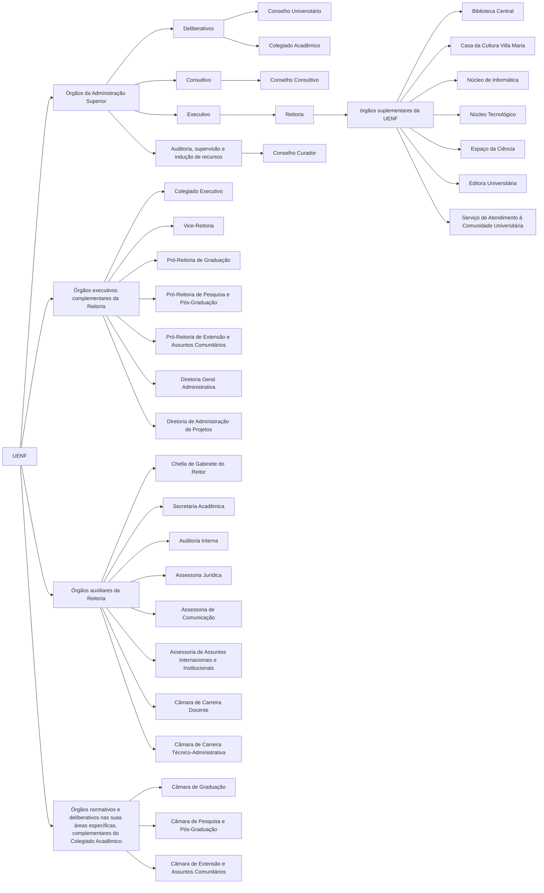

# Estatuto

UENF, com sede e foro na cidade de Campos dos Goytacazes e unidades instaladas em outros municípios do Estado do Rio de Janeiro

## TÍTULO I: DA UNIVERSIDADE E SEUS FINS

### CAPÍTULO II: DA ORGANIZAÇÃO

#### Art. 4º

Em sua organização, a Universidade deve observar os seguintes princípios:

1. I - unidade de patrimônio e administração;
2. II - organicidade de estrutura, com base em Laboratórios congregados por Centros;
3. III - racionalidade de organização, com plena utilização de recursos materiais e humanos;
4. VI - cooperação entre os Centros e os Laboratórios responsáveis pelos estudos compreendidos em cada curso, projeto ou programa.

#### Art. 6º

São órgãos da Administração Superior da UENF:

1. a) Deliberativos:
   1. I – Conselho Universitário
   2. II – Colegiado Acadêmico
2. b) Consultivo:
   1. I – Conselho Consultivo
3. c) Executivo
   1. I – Reitoria
4. d) De auditoria, supervisão e indução de recursos:
   1. I – Conselho Curador

---

1. § 1o - São órgãos executivos complementares da Reitoria:
    1. I - Colegiado Executivo
    2. II – Vice-Reitoria
    3. III - Pró-Reitoria de Graduação
    4. IV - Pró-Reitoria de Pesquisa e Pós-Graduação
    5. V - Pró-Reitoria de Extensão e Assuntos Comunitários
    6. VI - Diretoria Geral Administrativa
    7. VII – Diretoria de Administração de Projetos
2. § 2o – São órgãos auxiliares da Reitoria:
    1. I - Chefia de Gabinete do Reitor
    2. II - Secretaria Acadêmica
    3. III - Auditoria Interna
    4. III - Assessoria Jurídica
    5. IV - Assessoria de Comunicação
    6. V - Assessoria de Assuntos Internacionais e Institucionais
    7. VII – Câmara de Carreira Docente
    8. VIII – Câmara de Carreira Técnico-Administrativa
3. § 3o – São órgãos normativos e deliberativos nas suas áreas específicas, complementares do Colegiado Acadêmico:
    1. I - Câmara de Graduação
    2. II - Câmara de Pesquisa e Pós-Graduação
    3. III - Câmara de Extensão e Assuntos Comunitários

#### Art. 7º

As unidades universitárias de ensino, pesquisa e extensão, definidas por áreas e conhecimento, são constituídas em Centros, que por sua vez congregam Laboratórios afins.

Parágrafo único - O Laboratório é a menor parte da estrutura universitária para todos os efeitos de organização administrativa, didático-científica, distribuição de pessoal e de representação nos órgãos colegiados da UENF.

#### Art. 8º

São órgãos suplementares da UENF, subordinados diretamente à Reitoria:

 1. I- Biblioteca Central
 2. II- Casa da Cultura Villa Maria
 3. III- Núcleo de Informática
 4. IV- Núcleo Tecnológico
 5. V- Espaço da Ciência
 6. VI- Editora Universitária
 7. VII- Serviço de Atendimento à Comunidade Universitária

## Anotação JV

Abaixo se encontra um diagrama escrito em mermaid de como a UENF está organizada.

## TÍTULO II: DA ADMINISTRAÇÃO UNIVERSITÁRIA

### CAPÍTULO I: DA ADMINISTRAÇÃO SUPERIOR

#### Art. 10

A administração superior tem

- Administração superior
  - órgão de consulta
    - Conselho Consultivo
  - órgão supervisor, auditor e indutor na captação de recursos
    - Conselho Curador
  - órgãos deliberativos
    - Conselho Universitário
    - Colegiado Acadêmico
    - Câmara de Graduação
    - Câmara de Pesquisa e Pós- Graduação
    - Câmara de Extensão e Assuntos Comunitários
  - órgãos executivos
    - Reitoria
    - Colegiado executivo
    - Pró-Reitorias
    - Diretoria Geral Administrativa
    - Diretoria de administração de Projetos

§ 3o - Os representantes dos Chefes de Laboratórios são eleitos por seus pares dos
respectivos Centros, com mandato de três anos, sendo permitida a
recondução.

#### Art. 15

São atribuições do Conselho Universitário:

V- aprovar os regimentos de todos os órgãos, unidades e serviços da Universidade;

§ 8o - Compete ao Colegiado Acadêmico:

X - aprovar o calendário escolar;

Categorias

#### Art.20 -

o atribuições do Reitor, com as responsabilidades definidas em Lei:
XV - expedir títulos honoríficos e dignidades, na forma prevista neste Estatuto;

DOS ÓRGÃOS AUXILIARES DA REITORIA E DOS ÓRGÃOS SUPLEMENTARES

#### Art. 28

À Secretaria Acadêmica, órgão auxiliar da Reitoria, compete:
I - coordenar a divulgação do horário escolar dos vários cursos da UENF, de modo a otimizar os recursos humanos, ampliar as opções de disciplinas para os alunos e tornar acessíveis os dados escolares;
II - centralizar os serviços de registro da vida escolar dos alunos, compreendendo inscrição, admissão, matrícula, créditos, opções, transferências, promoções, graduações e preparação dos respectivos diplomas, dentro das normas estabelecidas;

#### Art. 32

A administração do Centro é da competência do Diretor e de seu respectivo Conselho.

#### Art. 33

O Conselho de Centro é constituído dos seguintes membros:
I - Diretor do Centro, como seu presidente;
II - Chefes de Laboratório;

### CAPÍTULO II - DA ADMINISTRAÇÃO DOS CENTROS, DOS LABORATÓRIOS E DAS COORDENAÇÕES DE CURSO

SEÇÃO I - DOS CENTROS

#### Art. 34

São atribuições do Conselho de Centro:
XVII- designar, semestralmente, os professores responsáveis pelas disciplinas dos Cursos de Graduação e Programas de Pós-Graduação, ouvidos os respectivos Laboratórios, os Colegiados de Curso e Comissões de Coordenação;

SEÇÃO II - DOS LABORATÓRIOS

#### Art. 37

O Laboratório, que deve ter um número mínimo de 5 professores, é a unidade básica da estrutura universitária para todos os efeitos de organização administrativa, didático-científica, distribuição de pessoal e de representação nos órgãos colegiados da Universidade.
§ 1o – O Laboratório é responsável pelo planejamento, distribuição e execução das tarefas que lhe são peculiares em todos os níveis relativos ao ensino, pesquisa e extensão, na forma destas Normas.
§ 2o - Cada Laboratório pode ser integrado por vários setores específicos, em número variável, conforme se apresente a necessidade de constituição.
§ 3o - Cada Setor é coordenado por um professor designado pelo Chefe do respectivo Laboratório.

#### Art. 39

Cada Laboratório é chefiado por um docente da UENF, escolhido pelos seus pares, Professores lotados em regime de tempo integral no respectivo Laboratório, com notória experiência acadêmica, conforme estabelecido no Regimento Interno, entre os que tiverem sua candidatura homologada pelo Conselho de Centro.

SEÇÃO III
DAS COORDENAÇÕES DOS CURSOS

## TÍTULO III: DO REGIME ACADÊMICO

### CAPÍTULO I: DOS CURSOS, CURRÍCULOS E DISCIPLINAS

SEÇÃO II: DO REGIME ESCOLAR

#### Art. 63

Os calendários dos cursos de graduação e programas de pós- graduação e extensão são aprovados pelas correspondentes Câmaras, com observância do calendário da Universidade.
