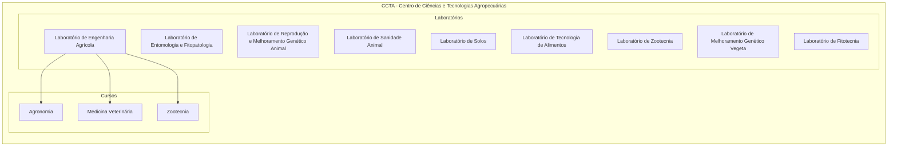

# CCTA - Centro de Ciências e Tecnologias Agropecuárias

```mermaid
  graph LR
  subgraph "CCTA - Centro de Ciências e Tecnologias Agropecuárias"
    subgraph "Cursos"
      Agro["Agronomia"]
      MV["Medicina Veterinária"]
      Z["Zootecnia"]
    end
    subgraph "Laboratórios"
      LEAG["Laboratório de Engenharia Agrícola"]
      LEF["Laboratório de Entomologia e Fitopatologia"]
      LRMGA["Laboratório de Reprodução e Melhoramento Genético Animal"]
      LSA["Laboratório de Sanidade Animal"]
      LSOL["Laboratório de Solos"]
      LTA["Laboratório de Tecnologia de Alimentos"]
      LZO["Laboratório de Zootecnia"]
      LMGV["Laboratório de Melhoramento Genético Vegeta"]
      LFIT["Laboratório de Fitotecnia"]
    end
  end
  LEAG --> Agro & MV & Z
```
