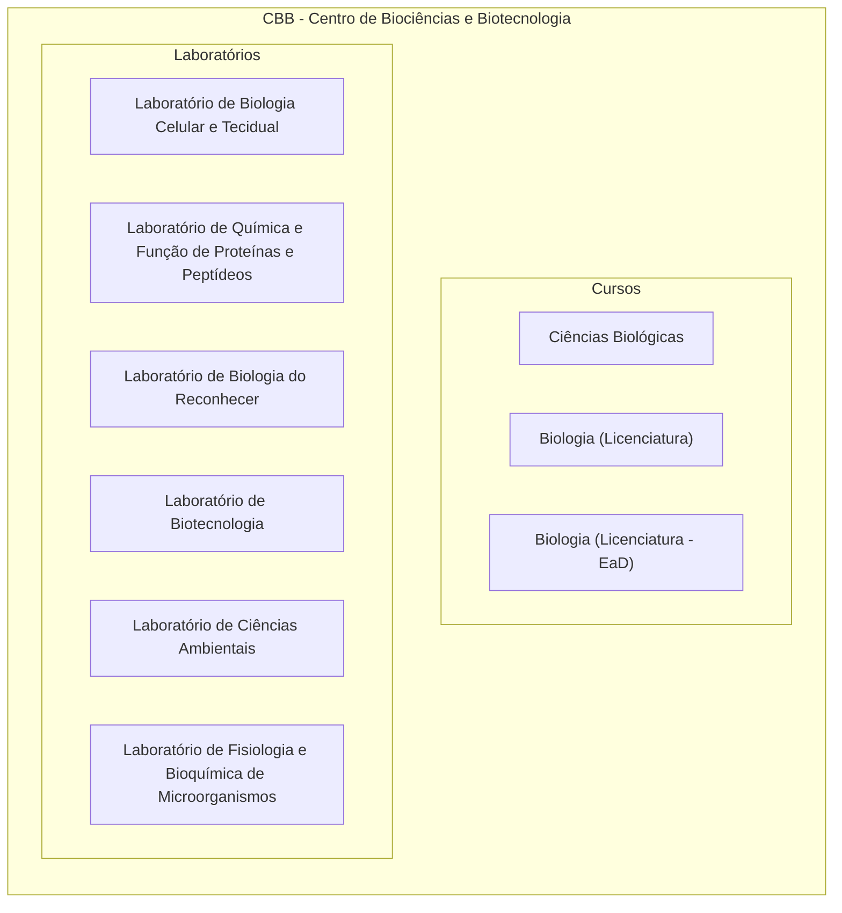

# CBB - Centro de Biociências e Biotecnologia

```mermaid
  graph LR
  subgraph "CBB - Centro de Biociências e Biotecnologia"
    subgraph "Cursos"
      CB["Ciências Biológicas"]
      LicBio["Biologia (Licenciatura)"]
      LicBioEAD["Biologia (Licenciatura - EaD)"]
    end
    subgraph "Laboratórios"
      LBCT["Laboratório de Biologia Celular e Tecidual"]
      LQFPP["Laboratório de Química e Função de Proteínas e Peptídeos"]
      LBR["Laboratório de Biologia do Reconhecer"]
      LBT["Laboratório de Biotecnologia"]
      LCA["Laboratório de Ciências Ambientais"]
      LFBM["Laboratório de Fisiologia e Bioquímica de Microorganismos"]
    end
  end
```
