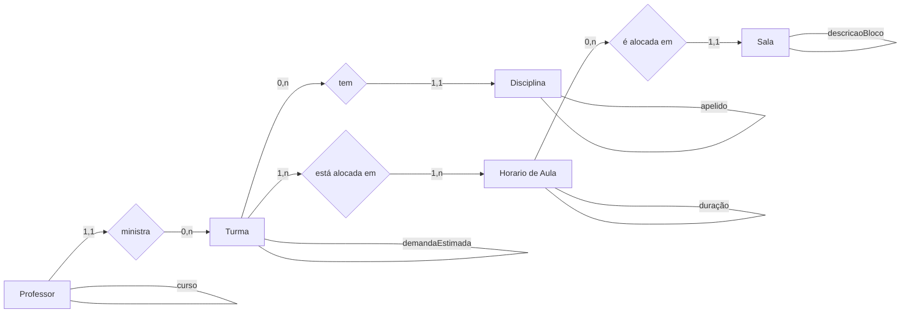
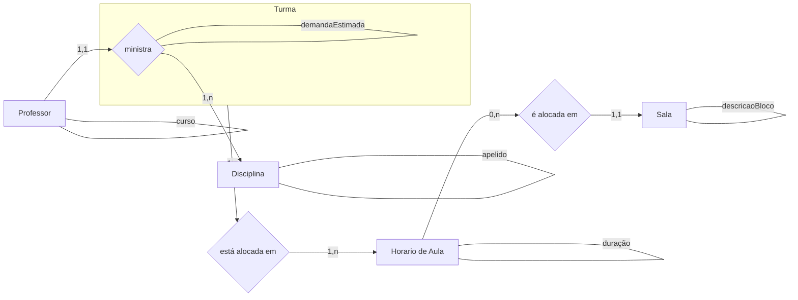
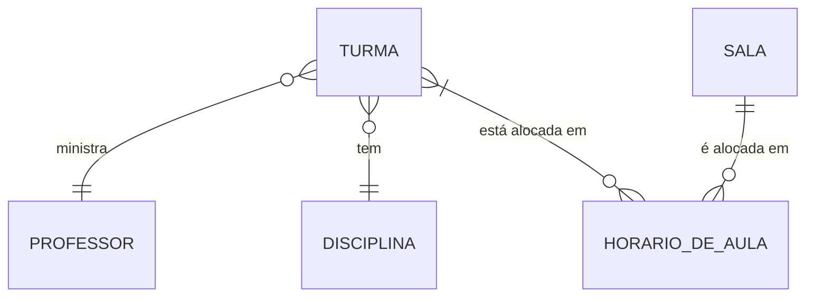

# Data Diagrams

## MVP

### Conceitual

### Esquema Relacional

- Professor(**nome**, apelidoProfessor, laboratorio, curso)
- Disciplina(**codigo**, apelidoDisciplina, periodo, nome)
- HorarioAula(**idHora**, diaSemana, horaInicio, duração)
- Sala(**blocoSala**, capacidade, bloco, codigo, descricaoBloco)
- Turma(**idTurma**, ano, semestre, demandaEstimada)

### Lógico

### ER

```mermaid
erDiagram
  Aluno ||--|{ AlunoCurso : "cursa"
  Curso ||--|{ AlunoCurso : "cursa"
  Curso ||--|{ Ementa : "possui"
  Curso ||--|{ Laboratorio : "é de um"
  Professor }|--|| Laboratorio : "é de um"
  Professor }|--|| PreferenciaHorario : "tem preferência por"
  Professor ||--|{ ProfessorDisciplina : "ministra"
  Disciplina ||--|{ ProfessorDisciplina : "ministra"
  Disciplina ||--|{ DisciplinaAluno : "cursa"
  Disciplina }|--o{ PreRequisitos : "pre requisita"
  PreRequisitos }o--|| Disciplina : "pre requisita"
  Disciplina ||--o{ CoRequisita : "co requisitam"
  CoRequisita }o--|{ Disciplina : "co requisitam"
  Disciplina }|--o{ Equivalencia : "equivale a"
  Equivalencia }o--|{ Disciplina : "equivale a"
  Disciplina ||--|{ DisciplinaEmenta : "refere a"
  Ementa ||--|{ DisciplinaEmenta : "contém"
  Situacao ||--|{ DisciplinaAluno : "define status de"
  Aluno ||--|{ DisciplinaAluno : "cursa"
  Aluno ||--|{ AlunoTurma : "integra"
  Turma ||--|{ AlunoTurma : "integra"
  Turma ||--|{ HorarioTurma : "é alocada em"
  Turma ||--|{ Sala : "está em uma"
  Turma }|--|| Professor : "é ministrada por"

  AlunoCurso {
    int Id FK
  }
  CoRequisita {
    int IdCoRequisitante FK
    int IdCoRequisitado FK
    int IdEmenta FK
  }
  PreRequisitos {
    int IdPreRequisitante FK
    int IdPreRequisitado FK
    int IdEmenta FK
  }
  Equivalencia {
    int IdEquivalente FK
    int IdEquivalida FK
    int IdEmenta FK
  }
  Aluno {
    id IdAluno PK
    int IdCurso FK
    int AnoIngresso
    int SemestreIngresso
    String CodigoMatricula
    string NomeAluno
  }
  DisciplinaAluno {
    string IdTurma FK
    int IdAluno FK
    int IdAlunoSituacaoDisciplina FK
    %% "string codigoDisciplina FK"
  }
  DisciplinaEmenta {
    string IdDisciplina FK
    id IdEmenta FK
    int IdCurso FK
    int PeriodoEsperado
  }
  AlunoTurma {
    int IdAluno PK, FK
    int IdTurma PK, FK
  }
  Turma {
    int IdTurma PK
    int IdSala FK
    string IdDisciplina FK
    int IdIdProfessor FK
    int Ano
    int Semestre
    int NumeroVagas
    int NumeroAlunosInscritos
  }
  HorarioTurma {
    int IdHorarioTurma PK
    int IdTurma FK
    string IdSala FK
    int TempoDuracao
    %% "% Separar horários numa classe separada?"
    int DiaSemana
    time HoraInicio
  }
  ProfessorDisciplina {
    int IdProfessor FK
    string NomeProfessor FK
    string CodigoDisciplina FK
  }
  PreferenciaHorario {
    id IdPreferencias PK
    int IdProfessor FK
    int GrauPreferencia
    %% "% Separar horários numa classe separada?"
    int DiaSemana
    time HoraInicio
  }
  %% Entidades estáticas Nível 2
  Disciplina {
    string IdDisciplina PK
    %%string codigoLaboratorio %% Precisa desse?
    string NomeDisciplina
    int NumeroHoraTeorica
    int NumeroHoraPratica
    int HorasExtraclasse "Opcional pro nosso escopo"
    int NumeroCredito
  }
  Professor {
    string IdProfessor PK
    string IdLaboratorio FK
    string NomeProfessor
  }
  Sala {
    id IdSala PK
    string CodigoSala
    int QuantidadeCadeira
    int QuantidadeComputador
    string NomeEdificio "Fora do escopo"
    bool IndicadorPossuiMonitor "Fora do escopo"
    bool IndicadorPossuiProjetor "Fora do escopo"
    bool IndicadorPossuiQuadroGiz "Fora do escopo"
    bool IndicadorPossuiQuadroPiloto "Fora do escopo"
  }
  Ementa {
    id IdEmenta PK
    date DataVigor PK
    id IdCurso FK
    string IdDisciplina FK
  }
  %% Entidades estáticas Nível 1
  Situacao {
    int IdSituacao PK
    string DescricaoSituacao
    %% "1: Aprovado, 2: Reprovado, 3: Cursando, 4: Não Cursado, 5: Outro"
  }
  Curso {
    id IdCurso PK
    string idLaboratorio FK
    string NomeCurso
  }
  Laboratorio {
    id IdLaboratorio PK
    string SiglaLaboratorio
    %% LAMET, LCFIS, LECIV, LCQUI, LAMAV, LCMAT, LEPROD, LENEP
    string NomeLaboratorio
  }
```

