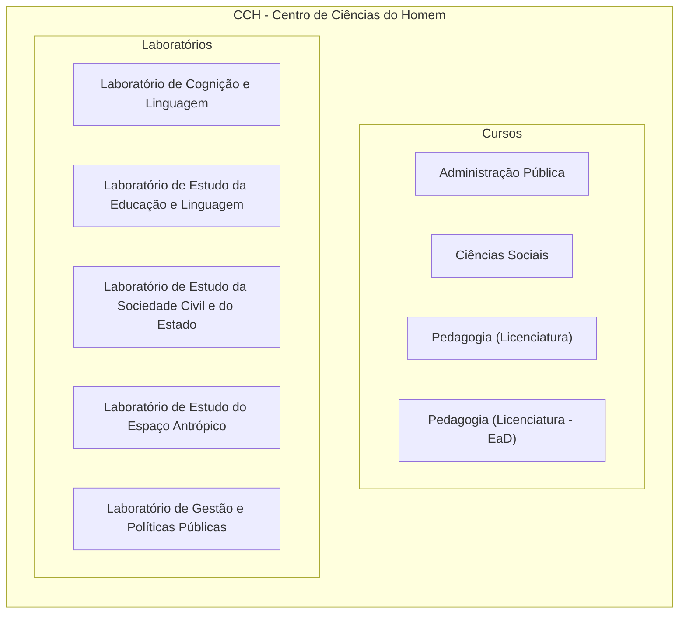

# CCH - Centro de Ciências do Homem

```mermaid
  graph LR
  subgraph "CCH - Centro de Ciências do Homem"
    subgraph "Cursos"
      Adm["Administração Pública"]
      CS["Ciências Sociais"]
      LicPed["Pedagogia (Licenciatura)"]
      LicPedEAD["Pedagogia (Licenciatura - EaD)"]
    end
    subgraph "Laboratórios"
      LCL["Laboratório de Cognição e Linguagem"]
      LEEL["Laboratório de Estudo da Educação e Linguagem"]
      LESCE["Laboratório de Estudo da Sociedade Civil e do Estado"]
      LEEA["Laboratório de Estudo do Espaço Antrópico"]
      LGPP["Laboratório de Gestão e Políticas Públicas"]
    end
  end
```
