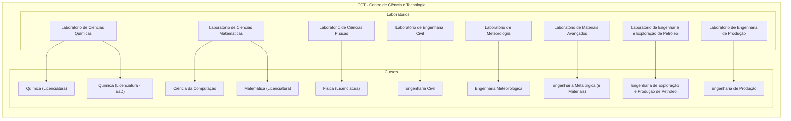

# CCT

```mermaid
  graph LR
  subgraph "CCT - Centro de Ciência e Tecnologia"
    subgraph "Cursos"
      CC["Ciência da Computação"]
      LicMat["Matemática (Licenciatura)"]
      LicQuim["Química (Licenciatura)"]
      LicQuimEAD["Química (Licenciatura - EaD)"]
      LicFis["Física (Licenciatura)"]
      EC["Engenharia Civil"]
      EM["Engenharia Meteorológica"]
      EMM["Engenharia Metalúrgica (e Materiais)"]
      EEP["Engenharia de Exploração e Produção de Petróleo"]
      EP["Engenharia de Produção"]
    end
    subgraph "Laboratórios"
      LCQUI["Laboratório de Ciências Químicas"]
      LCMAT["Laboratório de Ciências Matemáticas"]
      LCFIS["Laboratório de Ciências Físicas"]
      LECIV["Laboratório de Engenharia Civil"]
      LAMET["Laboratório de Meteorologia"]
      LAMAV["Laboratório de Materiais Avançados"]
      LENEP["Laboratório de Engenharia e Exploração de Petróleo"]
      LEPROD["Laboratório de Engenharia de Produção"]
    end
  end
  LCQUI --> LicQuim & LicQuimEAD
  LCMAT --> CC & LicMat
  LCFIS --> LicFis
  LECIV --> EC
  LAMET --> EM
  LAMAV --> EMM
  LENEP --> EEP
  LEPROD --> EP
```
