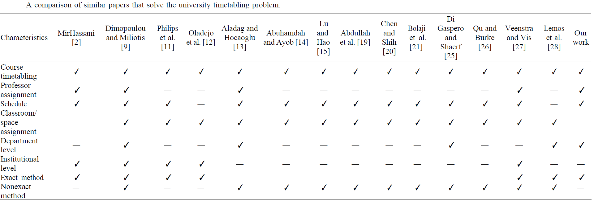
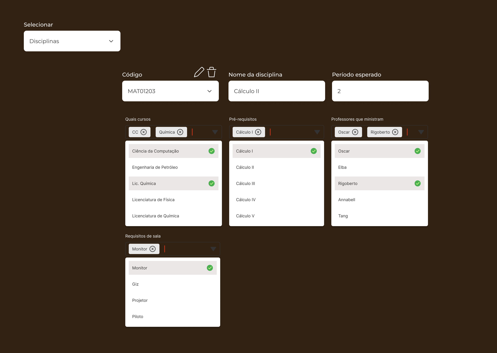
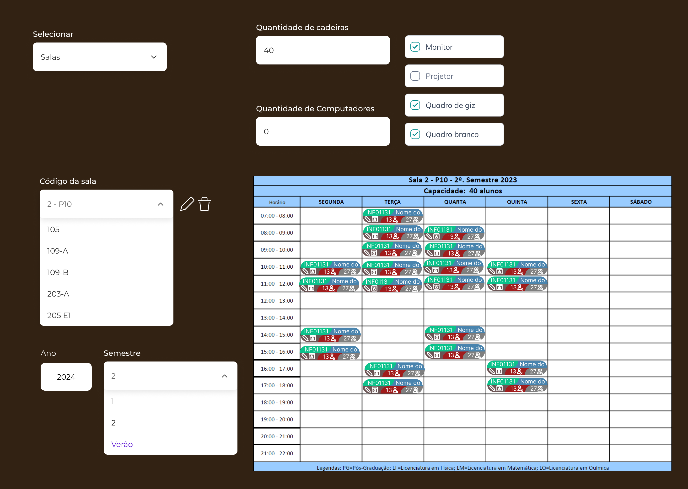

# TCC - WIP

<!-- Sim, eu sei que a numeração está errada  -->

## Capa

**Autor:** João Vítor Fernandes Dias

**Título:** _Timetabling Problem_: desafios no desenvolvimento de um sistema de decisão voltado ao problema de organização de grade horária do ensino superior

**Local:** Campos dos Goytacazes, RJ

**Orientador:** Prof. Dr. Fermín Alfredo Tang Montané

**Instituição:** Universidade Estadual do Norte Fluminense Darcy Ribeiro

**Curso:** Ciência da Computação

**Preambulo:** Trabalho de Conclusão de Curso apresentado ao Curso de Graduação em Ciência da Computação da Universidade Estadual do Norte Fluminense Darcy Ribeiro, sob orientação do Prof. Dr. Fermín Alfredo Tang Montané

---

## 1. Introdução <!-- Fazer algumas sutis alterações no português --> <!-- Fazer referência ao TCC do Ricardo falando sobre "Já existem no mercado algumas ferramentas que prometem a geração automatizada de grades de horários" --> <!-- Adicionar o que Sanya, Ricardo e Vieira 2011 falam em relação às ferramentas, buscando também um novo autor mais recente que diga o mesmo -->

<!--
% \chapter[Introdução]{Introdução}
-->

<!--    Coisas a dizer
- A realidade do ensino superior brasileiro
  - Muitas reprovações
  - Grade horária confusa
  - Professores limitados
  - Preferências diversas     X
    - Professores             X
      - Horários              X
    - Alunos
      - Estágio               X
      - Trabalho
      - Formar rápido
  - Demanda variada
  - Caso específico da UENF   X
-->

No ensino superior brasileiro, cada curso de uma instituição de ensino tem em seu projeto pedagógico, ou seja, no documento que rege quais as atribuições e justificativas de existência do curso, uma listagem de disciplinas a serem ministradas em cada semestre ao longo de sua duração esperada. Disciplinas estas que para serem cursadas os discentes precisam cumprir determinados requisitos. Por exemplo, é esperado que o discente apenas curse a disciplina Cálculo 2 após haver obtido a aprovação prévia na disciplina Cálculo 1.

<!-- Perguntas
% - Pesquisar quais são as regras que todos os cursos superiores devem seguir para serem reconhecidos pelo MEC
% - Qual a definição de projeto pedagógico?
% - Todos os PPCs dos cursos apresentam a listagem das disciplinas?
-->

Embora haja este planejamento de duração do curso, diversos fatores podem influenciar esta previsão, dentre eles podemos citar eventos como:

<!-- \begin{itemize}
    \item Quebra de pré-requisitos: onde o discente solicita permissão para inscrição em uma disciplina cujos pré-requisitos não são completamente cumpridos por si;
    \item Trancamento de matrícula: onde o discente suspende temporariamente seus estudos na instituição;
    \item Transferência interna: onde o discente migra entre cursos dentro da mesma instituição;
    \item Transferência externa: onde o discente migra entre cursos entre diferentes instituições;
    \item Reprovações: onde o discente não cumpre com o mínimo desempenho esperado na disciplina, geralmente está associado a ausência nas aulas e/ou desempenho inferior ao mínimo esperado nas avaliações;
    \item Disponibilidade de professores: onde os docentes não são suficientes para ministrar todas as disciplinas demandadas pelos discentes em um mesmo semestre.
\end{itemize} -->

- Quebra de pré-requisitos: onde o discente solicita permissão para inscrição em uma disciplina cujos pré-requisitos não são completamente cumpridos por si;
- Trancamento de matrícula: onde o discente suspende temporariamente seus estudos na instituição;
- Transferência interna: onde o discente migra entre cursos dentro da mesma instituição;
- Transferência externa: onde o discente migra entre cursos entre diferentes instituições;
- Reprovações: onde o discente não cumpre com o mínimo desempenho esperado na disciplina, geralmente está associado a ausência nas aulas e/ou desempenho inferior ao mínimo esperado nas avaliações;
- Disponibilidade de professores: onde os docentes não são suficientes para ministrar todas as disciplinas demandadas pelos discentes em um mesmo semestre.

Estes eventos tendem a, no geral, aumentar o tempo médio para conclusão do curso. Situação em sua maioria indesejada tanto pelos alunos, que mesmo durante seu estudo já visam o mercado de trabalho, quanto pelos professores e a instituição, visto que a evasão do ensino superior brasileiro é um problema existente e estudado a fim de ser minimizado.

<!--
- Pesquisar sobre motivos de evasão do ensino superior
- Adicionar citação
-->

Com isso, é esperado que a instituição busque alternativas para tornar mais dinâmica e atrativa a experiência dos discentes durante sua jornada. Uma dessas formas é tentando minimizar o impacto que as reprovações nas disciplinas causam nos semestres consecutivos. Para isso sendo então necessária uma análise das disciplinas que devem ser ministradas no próximo semestre, sendo então necessário definir **quais**, **quando**, **onde**, **por quem** e **para quem** serão ministradas. Esta tarefa, entretanto, não é trivial.

### 1.1. Problemáticas

<!-- ## \section{Problemáticas} % -->

Embora seja um problema atualmente, isso não significa que seja recente. Desde 1978 \cite{barham_simple_1978} o termo \textit{timetabling} encontra-se no meio acadêmico como o termo referente ao tabelamento de grade horária, sendo assim, é este o termo que será principalmente utilizado neste trabalho. Neste artigo de 1978 já se propunha uma forma para que se obtivesse um tabelamento otimizado, e demonstrava que o método utilizado gerava bons resultados.

Outra característica é informada por Joshua \cite{thomas_visualization_2009} que fala sobre a multidimensional do problema de timetabling. Por causa dessa questão há uma complexidade elevada para conseguir conceber visual e mentalmente de que forma os dados relacionados ao problema se estruturam, assim dificultando a elaboração de sistemas computacionais que auxiliem nessa tarefa.

Dada a grande quantidade de variáveis interconectadas e as características específicas de cada instituição \cite{miranda_udpskeduler_2012}, a organização destas informações buscando a melhor solução possível apresenta-se como um desafio. Principalmente se considerarmos que esta solução é, muitas vezes, buscada manualmente, estando também passível de erros humanos como ilustram as Figuras \ref{Academico} e \ref{CCT}.


<!-- \begin{figure}[htbp]\centering
    \caption{\label{Academico}Disciplina atribuída no sistema acadêmico à determinada hora e local}
    \includegraphics[angle=0,scale=0.8]{files/img/Falha_de_alocacao/Metodologia-Quinta.png}
    \legend{Fonte: o autor}
\end{figure}    % Imagem acadêmico

\begin{figure}[htbp]\centering
    \caption{\label{CCT}Disciplina não atribuída à determinada hora e local na grade de horários do CCT}
    \includegraphics[angle=0,scale=0.5]{files/img/Falha_de_alocacao/Aulas-CCT-105-2023_1.png}
    \legend{Fonte: o autor}
\end{figure}    % Imagem representando o erro humano na alocação de salas -->

Nestas imagens, fica exemplificado um dos possíveis problemas que podem ocorrer durante a criação de grades horárias, que é, mesmo quando uma seção da universidade (o Sistema Acadêmico, ilustrado pela Figura \ref{Academico}) aloca uma turma a uma determinada sala, outra seção da mesma instituição (o Centro de Ciência e Tecnologia, ilustrado pela Figura \ref{CCT}) pode não estar ciente do mesmo, ou mesmo estando ciente pode acabar não delimitando aquela lacuna de tempo como ocupada, assim estando passível de uma segunda alocação naquele período de tempo naquela sala, assim gerando problemas.

Também segundo J. Miranda, embora o problema de atribuição de salas não seja novo e tenha extensa literatura a seu respeito, são poucos os que de fato implementaram um sistema para suporte de decisões. Isso se dá por diversos fatores, também listado pelo autor fazendo referência a trabalhos anteriores, sendo alguns deles a resistência organizacional a mudanças e adoção de novas tecnologias, nível de dificuldade do problema, dentre outros.

<!--  Pegar a referência original? -->

Algumas outras características que se apresentam como problemas são a falta de otimalidade das grades horárias desenvolvidas em boa parte das instituições de ensino superior e a quantidade de tempo necessária para a criação dessas grades não-ótimas.

Considerando que situações como a descrita acima são passíveis de ocorrer, e que a tarefa de criação de grades horárias é recorrente, um sistema de suporte à decisão que supra às necessidades dos seus usuários se faz necessário.

<!-- \section{Hipótese} -->

### 1.2. Hipótese

Dada as características intrínsecas ao problema de agendamento de grade horária, é esperado que os softwares atualmente existentes que lidam com este problema não apresentem completas capacidades de se moldar ao caso de uma instituição específica.

E, caso a primeira hipótese se apresente correta, o software a ser desenvolvido, assim como seus similares, se apresentará como uma solução plausível para a resolução do problema proposto embora ainda apresente melhorias possíveis a serem implementadas. O software se apresentará de tal forma que os \textit{stakeholders} que, esperadamente, decidirem não o utilizar não causarão a impossibilidade do uso do sistema.

<!--
%- Os softwares existentes não são adequados para o caso específico
%- Embora seja possível implementar
%  - Será trabalhoso
%  - Precisará atender muitos requisitos
%  - Nem todos stakeholders aceitarão facilmente a mudança
%  - O sistema não será tão intuitivo quanto poderia ser
%  - Muitos não veem essa questão como um problema
%  - Alguns não acham necessário haver mudança no método de elaboração das grades
-->

<!-- \section{Objetivos} -->

### 1.3. Objetivos

Os objetivos deste documento podem ser divididos entre gerais e específicos, não havendo relação de superioridade de um em relação ao outro, visto que ambos igualmente nortearão o desenvolvimento da pesquisa.

<!-- \subsection{Gerais} -->

#### 1.3.1. Gerais

<!--
%- Sistema de suporte à decisão
%  - Eficiente
%  - Eficaz
%  - Efetivo
%- Criar grades horárias melhores, preferencialmente ótimas
%- Reduzir tempo necessário para criação das tabelas
%- Reduzir conflitos
%- Aumentar satisfação geral com as disciplinas e horários ofertados
-->

Como objetivos gerais, espera-se conseguir desenvolver um sistema de suporte à decisão tal que aumente a eficiência, eficácia e efetividade do processo de criação de grades horárias que semestralmente demandam extensa quantidade de tempo dos coordenadores de curso na UENF e não alcançam a otimalidade. Nesse processo, também é esperado que as grades horárias finais tragam benefícios aos alunos como forma de mais disciplinas à sua disposição. Visto que estes muitas vezes lidam com grades horárias que não contemplam suas reais demandas. Dessa forma aumentando a satisfação de todos os participantes do processo, desde os coordenadores de curso até os alunos.

<!-- \subsection{Específicos} -->

#### 1.3.2. Específicos

Como objetivos mais específicos, podemos listar os seguintes:

<!--
\begin{itemize}
    \item Entender de que forma os setores administrativos da UENF atualmente lidam com a questão do \textit{timetabling};
    \item Obter as demandas de aprimoramentos desejadas pelos diferentes centros e laboratórios;
    \item Modelar o sistema de resolução de \textit{timetabling} de acordo com os requisitos demandados;
    \item Encontrar o que é necessário para a adoção da aplicação de tabelamento de horário;
    \item Incentivar o uso de uma ferramenta centralizada para a otimização do \textit{Timetabling Problem}.
\end{itemize}
-->

- Entender de que forma os setores administrativos da UENF atualmente lidam com a questão do \textit{timetabling};
- Obter as demandas de aprimoramentos desejadas pelos diferentes centros e laboratórios;
- Modelar o sistema de resolução de \textit{timetabling} de acordo com os requisitos demandados;
- Encontrar o que é necessário para a adoção da aplicação de tabelamento de horário;
- Incentivar o uso de uma ferramenta centralizada para a otimização do \textit{Timetabling Problem}.

<!-- ## \section{Justificativas} -->

### 1.4. Justificativas

Levando em conta a problemática evidenciada e os sucessos prévios dos artigos anteriores, vê-se grande potencial de auxílio e aumento na satisfação de todos os que utilizarem os métodos propostos. Não havendo um sistema geral que solucione todos os casos como evidenciado pelos pesquisadores da área, resta aos interessados rumarem em busca de uma solução entalhada nos moldes de sua instituição específica. Considerando que é um problema existente atualmente e que uma solução está disponível, o que se torna necessário é realizar o esforço inicial suficiente para que ocorra a quebra da inércia em que se encontram os processos ineficientes usuais para assim alcançar um melhor. Sendo assim, faz-se válida a pesquisa e desenvolvimento de um software que vise este propósito.

<!--
% - Levando em conta a problemática e o os sucessos prévios de artigos anteriores
% - As instituições públicas idealmente deveriam ter um sistema próprio para a resolução de seus próprios conflitos
% - Não havendo o interesse ou conhecimento geral para este fim, resta aos alunos e pesquisadores interessados buscarem uma solução entalhada nos moldes de sua instituição
% - Considerando que é um problema existente na instituição e que é resolvível, sendo necessário o esforço inicial de quebrar a inércia dos processos usuais para se alcançar um melhor, faz-se válida a pesquisa e desenvolvimento de um software que vise este propósito.
-->

<!-- ## \section{Metodologia} -->

### 1.5. Metodologia <!-- Alterar a parte final da metodologia -->

<!--
% - Entrevistas qualitativas com stakeholders     x
%   - Adicionar perguntas aqui                    .
% - Formulário quantitativo com alunos            x
%   - Adicionar perguntas aqui                    .
% - Elicitação de requisitos                      x
%   - Falar sobre o SWEBOK                        x
% - Desenvolvimento do software                   .
%   - CI/CD                                       .
%     - Testes                                    .
%     - GitHub                                    .
%   - Programação modular                         SWEBOK
%   - Obtenção de demanda                         .
%     - Extratos                                  .
%       - Processamento e limpeza                 .
%       - Estruturando dados                      .
%     - Acadêmico                                 .
%     - Formulário                                .
%   - Criando solução inicial                     .
%   - Otimizando                                  .
%     - Algoritmos                                .
%     - Interatividade                            .
%       - Visualização                            .
-->

Considerando as dificuldades encontradas em trabalhos anteriores, entende-se que o maior desafio será superar as especificidades que serão encontradas durante a modelagem da universidade em questão. Para isso, será inicialmente necessária uma pesquisa bibliográfica com foco no estudo das abordagens qualitativas realizadas anteriormente que obtiveram sucesso em elicitar os requisitos adequados para as instituições de ensino.

<!--
% Adicionar referência sobre pesquisa qualitativa?
-->

Com este conhecimento, um material inicial para a pesquisa exploratória e qualitativa deve ser desenvolvido levando em conta as questões próprias da universidade em questão, visando também coletar dados relevantes para uma futura pesquisa com maior enfoque em características emergentes que a pesquisa anterior pode levantar, similar a como foi proposto e realizado por \cite{andre_interaction_2018}.

Nesta pesquisa exploratória em formato de entrevista, algumas informações esperadas revolvem em torno das percepções dos \textit{stakeholders} do sistema proposto, sendo esses principalmente os professores, coordenadores de cursos, chefes de laboratório e diretores de centro. Estas percepções incluem o entendimento deles quanto ao método atual e às alternativas existentes, nível de insatisfação com o método atual, nível de desejo quanto à um novo método. Além disso, espera-se aproveitar o ensejo para elicitar as características e funcionalidades que gostariam de ter em um sistema de suporte à decisão, solicitando também que deem informações adicionais que gostariam de acrescentar.

Essas informações serão relevantes para se atingir a satisfação e uso futuro do sistema proposto. Pois, como é informado no \cite{bourque_swebok_2014}, uma das fontes de requisitos é o ambiente organizacional e como o software muitas vezes visa auxiliar em algum processo da instituição, processo este já condicionado à sua estrutura, cultura e políticas externas, o engenheiro de software precisa estar atento a elas, visto que o novo software não deve forçar mudanças não planejadas em processos de negócios.

Questionamentos similares também serão realizados com alunos, porém em formato de formulário online para facilitar o processamento dos dados coletados.

<!--
\def\LinkParadigm{https://www.visual-paradigm.com/}
\def\LinkDrawio{https://www.drawio.com/}
\def\LinkMermaid{https://mermaid.js.org/}
-->

[LinkDrawio]: https://www.drawio.com/
[LinkMermaid]: https://mermaid.js.org/
[LinkVisualParadigm]: https://www.visual-paradigm.com/

Tendo obtido as informações dos \textit{stakeholders} primários, será então necessário modelar quais são as regras que ditam a estrutura organizacional em foco. Para este fim, serão utilizados diagramas conceituais utilizando softwares de suporte como o [Visual Paradigm][LinkVisualParadigm], [draw.io][LinkDrawio] e a [ferramenta Mermaid][LinkMermaid].

<!--
% Essa parte de baixo está muito estranha. Revisar depois
-->

Esta etapa será de grande importância pois guiará a pesquisa para quais serão os detalhes dos módulos existentes durante o desenvolvimento do projeto, bem como esclarecerá visualmente quais são as informações sobre os recursos que são necessárias para se calcular a grade ótima. Como por exemplo:

<!--

\begin{enumerate}
    \item Salas
    \begin{enumerate}
        \item Quais são as salas disponíveis?
        \item Quais as capacidades de cada um?
        \item Em quais horários estão disponíveis?
        \item Quais são suas peculiaridades?
        \begin{enumerate}
            \item Têm computadores?
            \item Têm quadro?
            \item Têm televisão?
            \item Têm projetor?
        \end{enumerate}
    \end{enumerate}
    \item Alunos
    \begin{enumerate}
        \item Quantos são?
        \item Quais matérias demandam?
    \end{enumerate}
    \item Professores
    \begin{enumerate}
        \item Quais disciplinas ministram?
        \item Quantas disciplinas podem ministrar?
        \item Quais seus horários de preferência?
    \end{enumerate}
\end{enumerate}
-->

- Salas
  - Quais são as salas disponíveis?
  - Quais as capacidades de cada um?
  - Em quais horários estão disponíveis?
  - Quais são suas peculiaridades?
    - Têm computadores?
    - Têm quadro?
    - Têm televisão?
    - Têm projetor?
- Alunos
  - Quantos são?
  - Quais matérias demandam?
- Professores
  - Quais disciplinas ministram?
  - Quantas disciplinas podem ministrar?
  - Quais seus horários de preferência?

<!-- Realmente vou testar? -->

Com as regras organizacionais e variáveis bem definidas, serão testados alguns softwares que visam a criação de grades horárias para confirmar se há a real necessidade de se desenvolver um software específico para a instituição. Após realizados os testes, caso os softwares existentes supram as necessidades, este será utilizado nos passos seguintes. De outro modo, haverá a necessidade de desenvolvimento de um sistema de suporte à decisão como ferramenta centralizada para este fim.

Independente de qual dos softwares será testada a aplicabilidade do mesmo no contexto universitário e será mensurada a satisfação dos \textit{stakeholders} durante o seu uso, assim buscando assegurar o seu uso na criação de grades horárias ótimas futuras.

<!--
% \section{Organização}
-->

### 1.6. Estrutura/Organização

Este trabalho abordará capítulos que de forma resumida lidam com os seguintes tópicos:

<!--
\begin{itemize}
    \item O capítulo 1 de introdução traça informações gerais sobre o assunto do trabalho, elaborando mais detalhadamente quanto à sua problemática, hipótese, objetivos, justificativas, a metodologia escolhida e a organização de suas informações.
    \item O capítulo 2 de revisão literária informa mais detalhadamente sobre os problemas de agendamento, suas categorias, soluções, desafios e definições de termos.
    \item O capítulo 3 de desenvolvimento apresenta as informações coletadas durante as entrevistas. Apresenta também a estrutura geral dos códigos feitos, principalmente ilustrando quais os comportamentos esperados em cada um dos módulos, bem como quais foram as ferramentas utilizadas e as práticas seguidas.
    \item O Capítulo 4 de resultados e discussões demonstra o software final utilizado, apresenta comparações das qualidades entre grades horárias geradas pelo software e as que foram utilizadas nos últimos semestres. Apresenta também a pesquisa de satisfação realizada com os \textit{stakeholders} entrevistados no início do desenvolvimento.
    \item O Capítulo 5 da conclusão e trabalhos futuros finaliza o presente trabalho com os pensamentos gerais sobre a pesquisa e desenvolvimento, apresentando as características não abordadas e indicando caminhos a serem seguidos por pesquisadores posteriormente.
\end{itemize}
-->

- O capítulo 1 de introdução traça informações gerais sobre o assunto do trabalho, elaborando mais detalhadamente quanto à sua problemática, hipótese, objetivos, justificativas, a metodologia escolhida e a organização de suas informações.
- O capítulo 2 de revisão literária informa mais detalhadamente sobre os problemas de agendamento, suas categorias, soluções, desafios e definições de termos.
- O capítulo 3 de desenvolvimento apresenta as informações coletadas durante as entrevistas. Apresenta também a estrutura geral dos códigos feitos, principalmente ilustrando quais os comportamentos esperados em cada um dos módulos, bem como quais foram as ferramentas utilizadas e as práticas seguidas.
- O Capítulo 4 de resultados e discussões demonstra o software final utilizado, apresenta comparações das qualidades entre grades horárias geradas pelo software e as que foram utilizadas nos últimos semestres. Apresenta também a pesquisa de satisfação realizada com os \textit{stakeholders} entrevistados no início do desenvolvimento.
- O Capítulo 5 da conclusão e trabalhos futuros finaliza o presente trabalho com os pensamentos gerais sobre a pesquisa e desenvolvimento, apresentando as características não abordadas e indicando caminhos a serem seguidos por pesquisadores posteriormente.

---

## 2. Contexto do _Timetabling Problem_ no meio acadêmico

<!-- \chapter{Contexto acadêmico do \textit{Timetabling Problem}} -->

Antes de prosseguirmos com o desenrolar deste trabalho, é adequado que primeiro definamos alguns parâmetros para o melhor entendimento do que está por vir.

<!-- \section{Definição de termos} -->

<!-- O Problema de Programação de Horários (Timetabling Problem) é um problema de grande relevância e amplamente estudado na área de Pesquisa Operacional. Um número significativo de trabalhos sobre esse problema foi publicado nos últimos anos e conferências regulares discutem o tema no meio científico [Splinder2010]. -->
<!-- Sânya -->
<!-- O Problema de Programação de Horário Escolar pode ser generalizado como o escalonamento semanal das aulas em uma escola sem que professores e alunos tenham mais de uma aula ao mesmo tempo (estudantes são agrupados em turmas com os mesmos planos de aula). Já o Problema de Programação de Horário de Disciplinas em Universidades como o escalonamento semestral das aulas de um conjunto de disciplinas de uma universidade de modo a evitar colisão de horários (estudantes geralmente são considerados individualmente) [Paim__2010]. -->
<!-- Sânya -->

### 2.1 Definição de termos

Ao longo dos anos de desenvolvimento acadêmico, diversos assuntos vão se aprofundando e se tornando mais específicos, assim, os estudiosos acabam cunhando novos termos que o auxiliam a desvencilhar as novas áreas específicas das suas áreas originárias. Porém, existe o potencial de que haja um crescimento desestruturado destes novos termos, assim vários termos diferentes podem se referir a um mesmo conceito, enquanto que um mesmo tempo pode se referir a vários conceitos diferentes de acordo com o autor.

Assim como feito por \cite{goos_scheduling_1996}, definiremos os conceitos dos termos que serão usados ao longo deste trabalho.

O termo "\textit{timetable}" tem o mesmo valor que "grade horária" e serão usadas como se fossem sinônimos mesmo sendo de línguas diferentes. Segundo \cite{goos_scheduling_1996}, podemos definir \textit{timetable} como uma estrutura que mostra quando que eventos ocorrerão, não havendo necessariamente a alocação de recursos.

Vale ressaltar que este termo não tem seu uso limitado para os fins desta pesquisa, sendo também usado para problemas de alocação de enfermeiros, esportes, funcionários e transportes \cite{arratia-martinez_university_2021}. Entretanto, neste trabalho, abordaremos principalmente os termos relacionados ao que pode ser chamado de \textit{Educational Timetabling} (Ed-TT) \cite{alencar_visualization_2019}, que é o que tende a envolver um conjunto específico de recursos relacionados à educação.

<!-- Sânya fala sobre International Timetabling Competition -->

Wren também define os conceitos para \textit{class timetable}, \textit{university examination timetable} e \textit{university class timetable}, tendo relevância apenas o último, que considera a disponibilidade de professores e salas, a quantidade de alunos e os requisitos que determinada disciplina exige.

Exemplo: Enquanto que a disciplina "Laboratório de Física" exige que a aula seja ministrada em um tipo de sala específica com os equipamentos necessários, a disciplina "computação e sociedade" não apresenta esta restrição, ficando limitada apenas à quantidade de pessoas na turma.

Aqui, visto que uma solução final envolverá várias dimensões (Professores x Disciplinas x Sala x Alunos x Horários x Dias), consideraremos \textit{timetable} como esse pacote de valores distribuídos em uma só estrutura. Para que esses valores sejam distribuídos, daremos o nome de \textbf{alocação} ao ato de criar qualquer relação entre as dimensões. Como a relação de horários e dias será considerada fixa, a \textbf{alocação} se referirá à atribuição como a de professores a disciplinas, disciplinas a salas, disciplinas a um determinado padrão de dias e horários, etc.

Para que esta alocação ocorra, é necessário atender a certos critérios, e aí entra o "problema de organização de grade horária", também chamado de \textit{timetabling problem}. Esta é uma subcategoria do \textbf{problema de agendamento} (\textit{scheduling Optimization Problem}) \cite{alencar_visualization_2019} que por sua vez é definido por \cite{goos_scheduling_1996} como sendo:

<!--
\begin{quote}\footnotesize
    Resolver problemas práticos relacionados à alocação, sujeito a restrições, de recursos a objetos sendo colocados no espaço-tempo, usando ou desenvolvendo quaisquer ferramentas que possam ser apropriadas. Os problemas irão frequentemente se relacionar à satisfação de certos objetivos.
\end{quote}
-->
> Resolver problemas práticos relacionados à alocação, sujeito a restrições, de recursos a objetos sendo colocados no espaço-tempo, usando ou desenvolvendo quaisquer ferramentas que possam ser apropriadas. Os problemas irão frequentemente se relacionar à satisfação de certos objetivos.

Outro termo relevante a se pontuar são as \textit{hard and soft constraints} que podemos chamar de restrições rígidas e flexíveis. \cite{alencar_visualization_2019} as define dizendo que as restrições rígidas são de atendimento obrigatório, enquanto as restrições flexíveis são opcionais, mas convenientes para melhorar a qualidade da solução obtida.

Exemplo de restrição rígida: nem professores nem alunos podem ser alocados simultaneamente a duas salas ou disciplinas simultaneamente. Uma solução que viole esta restrição se torna automaticamente inviável.

Exemplo de restrição flexível: professor J. prefere não dar aulas nas tardes de sexta-feira, e prefere dar aula nas manhãs da segunda-feira. Uma solução que viole esta restrição não se torna inviável, porém tende a ter menos valor neste critério do que uma solução que siga as preferências definidas.

Alguns outros termos similares a este campo de pesquisa encontrados na literatura são \textit{periodic event scheduling problem}, \textit{timetable scheduling}, \textit{class scheduling}, \textit{student scheduling}, \textit{university course timetabling}, dentre outros.

<!--
\section{Métodos de resolução}
-->

### 2.2. Métodos de resolução

<!--
% - O problema de timetabling   a
%   - Origem                    a
%   - Repartições               a
%   - Escopo maior              a
%     - Scheduling              a
%   - Escopo menor              a
%     - Exam                    a
%     - Class                   a
% - TT
%   - Soluções
%   - Desafios
%   - Diversas formas de resolução
%     - Graph Coloring
%     - Heurísticas
%     - Meta-heurísticas
%     - IA
%     - etc.
% - Visualização de informações
%   - Benefícios
%   - Motivações
%   - Relação com timetabling
% - Problema geral a ser resolvido
%   - Multi dimensionalidade
%     - Professores
%     - Alunos
%     - Salas
%     - Departamentos
%       - Preferências
%       - Concorrências
%   - Otimalidade
%   - Erros humanos
%   - Número de possibilidades
%   - Interface intuitiva e relevante é um desafio com poucos estudos nos últimos anos
% - Problemas específicos
%   - Regras específicas
%   - Prioridades diferentes
%   - estrutura organizacional semi-exclusiva
-->

<!--
% Pesquisar posteriormente sobre imagens que ilustrem bem as diferentes sub categorias de scheduling
-->

Existem diversas implementações já realizadas, utilizando uma miríade de métodos. Em seu trabalho \cite{miranda_udpskeduler_2012}, J. Miranda informa sobre diversos sistemas baseados em computador para auxiliar na tarefa de agendamento. J. Miranda também cita um dos métodos de resolução como sendo o \textbf{modelo de programação inteira} e \textbf{heurísticas}.

Outros trabalhos buscaram condensar em forma de tabela as informações encontradas. Abaixo estão dispostas algumas das tabelas encontradas durante o estudo bibliográfico e que foram elaboradas por diversos autores.

Na figura \ref{Desenvolvimento}, \cite{alegre_desenvolvimento_2012} traça a relação entre os diversos autores, ano de sua publicação e seu país de origem com os dados encontrados em seus trabalhos quanto aos parâmetros utilizados na elaboração da grade horária, quão grandes eram cada um de seus parâmetros, quanto tempo foi necessário para achar uma solução e quais foram as técnicas utilizadas.

<!-- % Entender o que está dando errado aqui depois -->


<!--
\begin{figure}[htbp]\centering
    \caption{\label{Desenvolvimento}Resumo de trabalhos, parâmetros, dimensões, tempo e técnicas.}
    \includegraphics[angle=0,scale=1]{files/img/tabelas/Desenvolvimento.png}
    \legend{Fonte: \cite{alegre_desenvolvimento_2012}}
\end{figure}    % Desenvolvimento
-->

Na figura \ref{University}, \cite{arratia-martinez_university_2021}, apresenta uma comparação similar à anterior, porém não separada em categorias, apenas categorizando entre verdadeiro e falso algumas características como alocação de salas, professores, nível institucional e método exato ou inexato.



<!--
\begin{figure}[htbp]\centering
    \caption{\label{University}Comparação entre artigos que solucionam o problema de grade horária}
    \includegraphics[angle=0,scale=0.37]{files/img/tabelas/University.png}
    \legend{Fonte: \cite{arratia-martinez_university_2021} - editado}
\end{figure}    % University
-->

Na figura \ref{Visualization}, \cite{alencar_visualization_2019} explora uma categoria mais específica do problema, que é a característica da interatividade das interfaces desenvolvidas. Este apresenta características qualitativas quanto aos métodos, os dados dispostos, as técnicas de interação e o método utilizado para solucionar o problema de grade horária educacional. Nesta figura, os autores usam "Y" para simbolizar "Sim", "N" para "Não" e "-" para "Inconclusivo".


<!--
\begin{figure}[htbp]\centering
    \caption{\label{Visualization}Análise de publicações aceitas.}
    \includegraphics[angle=0,scale=0.7]{files/img/tabelas/Visualization.png}
    \legend{Fonte: \cite{alencar_visualization_2019} - editado}
\end{figure}    % Visualization
-->

<!--
\section{Desafios recorrentes}
-->

### 2.3. Desafios recorrentes

Apesar da vasta quantidade de trabalhos realizados com este fim, o \textit{Timetabling Problem} segue sendo uma área sem uma solução definitiva.

Tomáš Müller \cite{burke_modeling_2007} traz a questão da modelagem como um dos maiores obstáculos. À medida em que a complexidade aumenta, se torna cada vez mais difícil desenvolver uma solução efetiva. Assim fazendo com que a solução para uma universidade possa não ter utilidade para outras, ou até mesmo não seja capaz de lidar com todos os problemas de uma mesma universidade.

Apesar do contrafluxo encontrado na resolução desse problema, Tomáš cita que, apesar da complexidade, é sim possível desenvolver soluções que tenham uso prático, mesmo que não seja um processo fácil. As ferramentas existem e estão disponíveis. Restando então considerar e resolver as preocupações dos usuários às questões, visto que as técnicas de resolução já se encontram vastamente documentados.

Com isso, entramos também no ramo da Interação Homem-Máquina, ramo abordado por Dinata \cite{andre_interaction_2018} que visou em seu desenvolvimento a criação de uma interface focada no usuário. Assim minimizando o atrito na abordagem desse problema complexo. Também sendo área de enfoque de \cite{alencar_visualization_2019} em sua revisão literária

<!--
% ### 2.5. Contexto histórico e origem

% - Como surgiu essa área? Em que momento ela se dividiu? Devo falar sobre isso?

% ### 2.6. Técnicas existentes(?)

% - Falar sobre técnicas existentes e quem já fez. Tipo o que aquele artigo sem DOI fez
-->

### 2.4. Trabalhos anteriores

Este trabalho não se mostra desprovido de histórico na tentativa de resolução do mesmo problema. Sânya e Ricardo, ambos estudantes de Ciência da Computação da UENF, já realizaram trabalhos com o mesmo fim, porém com abordagens diferentes da atual proposta.

Tendo vista que atualmente o problema de Programação Horária da UENF ainda perdura, podemos considerar que embora os trabalhos anteriores tenham se mostrado importantes ao pavimentar o caminho em direção à resolução da problemática disposta, as soluções ótimas encontradas por ambos, embora ótimas para a modelagem proposta, não se mostraram ótimas para a realidade da universidade.

Abaixo são listados os trabalhos anteriores e suas respectivas abordagens, bem como os apontamentos do que se mostrou inviável para a realidade da universidade.

#### 2.4.1. Sânya

Em seu trabalho, Sânya aborda o problema de Programação de Horários de Disciplinas em Universidades, tendo como foco o curso de Ciência da Computação da UENF. Sua abordagem foi a de desenvolver um software que fosse capaz de gerar uma grade horária ótima para o curso, levando em conta as restrições impostas pelo curso. Para isso, Sânya explicou diversos métodos possíveis para se alcançar a solução desejada, passando inicialmente pelos métodos construtivos, seguido de métodos refinamento, podendo essas heurísticas serem utilizadas em conjunto com meta-heurísticas.

Por fim, utilizou uma heurística que consistia em respeitar a uma matriz de preferência para a distribuição das disciplinas. Seguindo com o uso do _Simulated Annealing_ para a otimização da solução inicial.

#### 2.4.2. Ricardo

- Contato dele
- Turma vs aluno
- Fixo vs solto
- Um professor por disciplina
- Uma turma por disciplina
- Disciplinas de um mesmo período não conflitando
- Dois horários de aula no mesmo dia: hard x soft
- Tamanha eficiência é de fato necessária?

> Como possível trabalho futuro propõe-se o aperfeiçoamento da interface gráfica e do banco de dados da ferramenta desenvolvida para que seja possível armazenar um maior número de informações pertinentes ao problema de uma forma eficiente, para que o usuário possa realizar modificações no quadro de horários e a ferramenta seja capaz de informar se essas modificações são viáveis ou não e para que a escolha dos dados usados na resolução do problema tenha uma maior flexibilidade. Além disso, os mecanismos usados na implementação da Função Objetivo (função que avalia a qualidade das soluções obtidas) podem ser aperfeiçoados com o intuito de cada vez mais atender a um maior número de particularidades do dia a dia do curso de Ciência da Computação da UENF.

#### 2.4.3. Divergências

##### Sânya

É dito por Sânya que:

> Como na UENF a tarefa de distribuição de sala não varia muito a cada período, sendo feito separadamente por cada centro [...]

Embora possamos entender o conceito de "variar muito" como subjetivo, considerando que mesmo ao longo de um mesmo semestre existem realocações de salas e professores dentro do contexto de um mesmo Centro, podemos entender que a realidade da UENF é de fato muito dinâmica, não se encaixando completamente na solução de alocação única inicial de salas e professores.

Pode-se alegar que tratar da variabilidade de alocações de salas de um mesmo Centro foge do escopo do trabalho, porém, para que o coordenador da Computação tenha fácil acesso aos dados de alocação de salas disponíveis, faz-se necessário que seu uso esteja compartilhado com o Diretor do Centro de Ciência e Tecnologia (CCT), visto que este é o responsável pela alocação de salas de todos os cursos do CCT.

> [...] e as aulas que necessitam de salas com recursos especiais são geralmente já preestabelecidas, não há necessidade de automatizar esta tarefa de distribuição de salas.

Algumas turmas são historicamente alocadas à determinadas salas, mas isso não significa necessariamente que esta alocação é a mais adequada para a mesma. Então, todas as salas, mesmo que inicialmente pré-estabelecidas, devem estar passíveis de mudanças, mas com possibilidade de se fixar.

> Outra tarefa que no presente cenário do curso de Ciência da Computação não viabiliza algum tipo de automatização é a distribuição de professores, pois além de um número muito pequeno destes, não há muitas alternativas de mudanças de suas respectivas disciplinas.

Quanto à distribuição de professores, a realidade do curso de Ciência da Computação segue a mesma da que foi apontada em 2013 por Sânya. Entretanto, cada professor tem sua própria gama de disciplinas que se dispõe a ministrar, e a coordenação tende a distribuí-los de acordo com sua preferência. Entretanto, como a demanda dos alunos não se mostra linear como foi estudado, é possível que a distribuição de professores seja feita de forma mais eficiente, considerando a demanda dos alunos, ainda que não se descartem suas preferências pessoais.

> Requisitos essenciais, ou seja, obrigatórios:
>
> RE1 - Um professor não pode lecionar aula em duas turmas diferentes no mesmo horário.
> RE2 - Uma turma não pode ter aula em duas disciplinas no mesmo horário.
>
> Requisitos não essenciais, de qualidade:
>
> RNE1 - O ideal é que existam no máximo duas aulas consecutivas da mesma disciplina.
> RNE2 - Não devem haver mais de duas aulas da mesma disciplina em um dia.
> RNE3 - Não preencher os horários de 12h às 14h, pois se trata de horário de almoço.
> RNE4 - Os professores associados, por terem exclusividade com a instituição, preferem espalhar os horários das aulas dadas, e não acumular todas no mesmo dia.
> RNE5 - Os professores contratados, por outro lado, preferem que suas aulas sejam alocadas num mesmo dia, ou no menor número de dias possíveis.

Quanto à citada RE2, a limitação deveria ser mais criteriosa, e se tratando de um requisito não essencial, pois, o conceito de turma é dado pela junção de estudantes que cursam a mesma disciplina, ministrada por um mesmo professor, em um mesmo semestre. Mas em seu trabalho, Sânya considera o conceito de turma como sendo o conjunto de estudantes que ingressaram em um mesmo ano, independente da consideração da existência de repetentes e de suas escolhas pessoais de inscrição.

RNE1, RNE2 e RNE3: todas elas não consideram a existência de disciplinas que necessitam de um total de cinco tempos de aula semanais, sendo elas regularmente divididas em dois períodos, um de duas horas e outro de três horas. Que, em situações de necessidades, como é visto na entrevista com o diretor do CCT, acaba sim sendo necessário que se aloque em período de almoço.

RNE4 e RNE5: embora estejam direcionadas corretamente, ainda assim não engloba casos de preferência pessoal de cada um dos professores citados. Como por exemplo a possibilidade de não se ministrar aulas em determinados dias da semana por motivos religiosos, seja por parte do quadro permanente, quanto de professores associados.

Outra considerável divergência entre o modelo e a realidade é a definição de que a cada semestre contém apenas 5 turmas de computação. Sendo estas compostas pelos estudantes ingressantes de 5 anos consecutivos, caso este que não se aplica à realidade da universidade, visto que a quantidade de turmas varia de acordo com a demanda semestral, que não necessariamente condiz com todos os estudantes ingressantes de um mesmo ano.


## 3. Modelagem geral do sistema <!-- Modificar o texto para descrever o que o sistema de fato faz -->

<!--
\chapter{Modelagem geral do sistema}
-->

Tendo esclarecido sobre as questões gerais do trabalho e da área de estudo. Agora nos aprofundaremos um pouco mais na modelagem e criação de diagramas que ilustrem o funcionamento geral do sistema e a forma como se dará a execução da metodologia proposta.

<!--
\section{Estágios de execução}
-->

### 3.1 Estágios de execução

Em seu trabalho de aplicação prática, \cite{miranda_udpskeduler_2012} estruturou estágios que compõem o processo necessário para que enfim se alcance a definição de \textit{timetables} ótimas.


<!--
\begin{figure}[htbp]\centering
    \caption{\label{fig:geral} Estágios para a obtenção de grade horária ótima}
    \includegraphics[scale=0.5]{files/img/Arquitetura/Arquitetura-UDP.png}
    \legend{Fonte: \cite{miranda_udpskeduler_2012}}
\end{figure}
-->

Na Figura \ref{fig:geral}, estão dispostos 4 estágios principais. O primeiro dispõe da aquisição de informações. O meio de aquisição não é relevante para o momento atual, apenas considera-se que esta informação será obtida. No segundo estágios são definidas grades horárias preliminares para se atribuir os alunos. No terceiro, os alunos se inscrevem e a demanda é ajustada, por fim, no quarto estágio, ocorre a alocação final das salas.

<!--
\section{Iteração}
-->

### 3.2 Iteração

Para se alcançar uma alta satisfação por parte dos \textit{stakeholders}, vê-se necessária a constante interação com os mesmos. Para isto, será seguida a estrutura utilizada por \cite{andre_interaction_2018}.


<!--
\begin{figure}[htbp]\centering
    \caption{\label{fig:IxD} Etapas do Design de Interação}
    \includegraphics[scale=1]{files/img/Arquitetura/Arquitetura-IxD.png}
    \legend{Fonte: o autor}
\end{figure}    % University
-->

Seguindo o conceito do Design de Interação, a Figura \ref{fig:IxD} ilustra o ciclo de ações a serem tomadas durante o desenvolvimento do sistema, caso este venha a ser necessário. Neste modelo de pesquisa, os \textit{stakeholders} serão consultados continuamente enquanto lhes é apresentado protótipos do sistema, para que assim informem quanto às suas percepções. Esta dinâmica tem como finalidade encontrar um design tal que seja adequado aos desejos e necessidades de seus usuários finais.

<!--
\section{Funcionamento}
-->

### 3.3 Funcionamento

O sistema final seguirá uma dinâmica similar à que foi ilustrada por \cite{bebis_information_2019} em seu trabalho sobre o uso da Visualização de Informações em relação às Ed-TTPs.


<!--
\begin{figure}[htbp]\centering
    \caption{\label{fig:sistema} Funcionamento geral do sistema}
    \includegraphics[scale=0.6]{files/img/Arquitetura/Arquitetura_bebis_information_2019.png}
    \legend{Fonte: \cite{bebis_information_2019}}
\end{figure}
-->

A Figura \ref{fig:sistema} apresenta o comportamento geral do sistema, como seus diferentes segmentos interagem entre si e de que forma o usuário interage com o mesmo. O usuário poderá ajustar os objetivos da otimização e suas restrições, elas serão utilizadas nos métodos de otimização. Estes métodos serão utilizados para se alcançar soluções para estes critérios, as melhores serão então armazenadas. Em posso destes dados, a aplicação apresentará visualmente estas informações ao usuário, permitindo que ele interaja dinamicamente a fim de alcançar seus objetivos.

---

### 3.4. Marco Teórico <!-- O que e de quais disciplinas estou usando? -->

Tendo em vista que o trabalho envolve uma pletora de conhecimento de diversas áreas, é necessário que sejam definidos alguns conceitos que serão utilizados ao longo do trabalho.

- Estruturas de dados
- Algoritmos
- Engenharia de Software
- Pesquisa científica

<!--
[19:53, 09/11/2023] 💠: Conversamos sobre o marco teórico. Isso seria informar sobre os trabalhos anteriores de outros pesquisadores ou informar quais são os conteúdos disciplinares usados para o desenvolvimento da monografia?
[19:55, 09/11/2023] 🧑‍💻: Marco teórico seria apresentar, desenvolver os conteúdos usados na monografia.
[19:56, 09/11/2023] 💠: Aprofundar um pouco mais nos conceitos gerais?
[19:56, 09/11/2023] 🧑‍💻: Já revisão da literatura envolve, pesquisar, resumir e apresentar os trabalhos relacionados com a mesma temática.
[19:56, 09/11/2023] 🧑‍💻: Sim, tem que ter base teórica. E ao mesmo tempo, um contexto, como se encaixa seu trabalho no que já foi feito.
[19:58, 09/11/2023] 💠: Acho que consigo seguir com isso
-->

## 4. Estrutura organizacional da instituição estudada

Para que se possa entender melhor o problema, é necessário que se entenda a estrutura organizacional da UENF disposta no [Estatuto da UENF][LinkEstatutoUENF]. A [Universidade Estadual do Norte Fluminense Darcy Ribeiro (UENF)][LinkUENF], ainda que limitando ao que convém neste trabalho.

[LinkEstatutoUENF]: https://www.uenf.br/UENF_ARQUIVOS/Downloads/REITORIA_1360_1101117875.pdf
[LinkUENF]: https://uenf.br/portal/

### 4.1. A UENF e seu estatuto <!-- Provavelmente eu deveria adicionar informações sobre a secretaria acadêmica --> <!-- Precisa de revisão --> <!-- Sinto que falta falar sobre secretaria acadêmica e Conselho de Centro -->

Segundo o estatuto, a UENF compreende:

- Órgãos da Administração Superior de política, gestão e supervisão;
- Unidades universitárias de ensino, pesquisa e extensão;
- Órgãos e serviços especiais, destinados a auxiliar na administração e a suplementar as atividades de ensino, pesquisa, extensão e apoio técnico.

Quanto aos órgãos da Administração Superior devemos enfocar o órgão executivo, constituído unicamente pela reitoria, cujos órgãos auxiliares englobam a Secretaria Acadêmica, que por sua vez tem como algumas de suas atribuições as seguintes:

> I - Coordenar a divulgação do horário escolar dos vários cursos da UENF, de modo a otimizar os recursos humanos, ampliar as opções de disciplinas para os alunos e tornar acessíveis os dados escolares;
>
> II - **Centralizar os serviços de registro da vida escolar dos alunos**, compreendendo **inscrição**, admissão, **matrícula**, **créditos**, **opções**, transferências, **promoções**, graduações e preparação dos respectivos diplomas, dentro das normas estabelecidas;

Já quanto as unidades universitárias de ensino, temos no estatuto que:

> As unidades universitárias de ensino, pesquisa e extensão, definidas por áreas de conhecimento, são constituídas em Centros, que por sua vez congregam Laboratórios afins.
>
> O Laboratório é a menor parte da estrutura universitária para todos os efeitos de organização administrativa, didático-científica, distribuição de pessoal e de representação nos órgãos colegiados da UENF

A administração do Centro é da competência do Diretor e seu Conselho. Os Laboratórios, por sua vez, são administrados pelos Chefes de Laboratório.

O Conselho de Centro, tem como uma de suas atribuições:

> XVII- **designar, semestralmente, os professores responsáveis pelas disciplinas dos Cursos de Graduação** e Programas de Pós-Graduação, ouvidos os respectivos Laboratórios, os Colegiados de Curso e Comissões de Coordenação;

Atualmente, segundo o site da UENF, a universidade possui 4 Centros, sendo eles:

- Centro de Ciências do Homem - [CCH][LinkCCH]
- Centro de Ciência e Tecnologia - [CCT][LinkCCT]
- Centro de Biociências e Biotecnologia - [CBB][LinkCBB]
- Centro de Ciências e Tecnologias Agropecuárias - [CCTA][LinkCCTA]

[LinkCCH]: https://uenf.br/
[LinkCCT]: https://uenf.br/cct/
[LinkCBB]: https://uenf.br/
[LinkCCTA]: https://uenf.br/

E também existem 8 laboratórios vinculados ao Centro de Ciência e Tecnologia (CCT) possui 8 laboratórios, sendo eles:

- Laboratório de Meteorologia – [LAMET][LinkLCFIS]
- Laboratório de Ciências Físicas – [LCFIS][LinkLCMAT]
- Laboratório de Engenharia Civil – [LECIV][LinkLCQUI]
- Laboratório de Ciências Químicas – [LCQUI][LinkLECIV]
- Laboratório de Materiais Avançados – [LAMAV][LinkLENEP]
- Laboratório de Ciências Matemáticas – [LCMAT][LinkLEPROD]
- Laboratório de Engenharia de Produção – [LEPROD][LinkLAMAV]
- Laboratório de Engenharia e Exploração de Petróleo – [LENEP][LinkLAMET]

[LinkLCFIS]: https://uenf.br/cct/administracao/laboratorios/
[LinkLCMAT]: https://uenf.br/cct/lcmat/
[LinkLCQUI]: https://uenf.br/cct/administracao/laboratorios/
[LinkLECIV]: https://uenf.br/cct/administracao/laboratorios/
[LinkLENEP]: https://uenf.br/cct/administracao/laboratorios/
[LinkLEPROD]: https://uenf.br/cct/administracao/laboratorios/
[LinkLAMAV]: https://uenf.br/cct/administracao/laboratorios/
[LinkLAMET]: https://uenf.br/cct/administracao/laboratorios/

Os Laboratórios englobam os Cursos de Graduação e Pós-Graduação, que são administrados pelos Coordenadores de Curso.

Além disso, o LCMAT mantém dois cursos de graduação e um programa de pós-graduação stricto sensu. Sendo eles:

- [Licenciatura em Matemática][LinkLicMat]
- [Bacharelado em Ciência da Computação][LinkCC]
- [Mestrado Profissional em Matemática][LinkMestradoMat] – [PROFMAT][LinkPROFMAT] / [SBM][LinkSBM]

[LinkLicMat]: https://uenf.br/posgraduacao/licenciatura-matematica/
[LinkCC]: https://cc.uenf.br/
[LinkMestradoMat]: https://uenf.br/posgraduacao/matematica/apresentacao/
[LinkPROFMAT]: https://uenf.br/posgraduacao/programas/pos-graduacao-stricto-sensu/
[LinkSBM]: https://www.profmat-sbm.org.br/

### 4.2. Entrevistas <!-- Separar entrevistas de minhas opiniões pessoais -->

Como forma de entender melhor a percepção real daqueles que recorrentemente lidam com a tarefa de criação da grade horária, diversas entrevistas foram feitas com o intuito de analisar qualitativamente quais são as opiniões, pedidos, reclamações e pensamentos de diferentes níveis organizacionais da UENF.

#### 4.2.1. Diretor do CCT

O primeiro entrevistado foi o atual Diretor do CCT. Ele atualmente estrutura a relação de disciplinas ofertadas pelo CCT em Excel e as publica em formato PDF no [site do CCT][LinkCCTSalas]. Seu trabalho auxilia os Chefes de Laboratório e Coordenadores de Curso a visualizarem quais são as salas disponíveis e em quais horários cada professor está alocado.

[LinkCCTSalas]: https://uenf.br/cct/secretaria-academica/distribuicao-das-salas-de-aula-do-cct/

Um dos tópicos dialogados, foi quanto às categorias das disciplinas, ou seja, quais características notáveis as disciplinas poderiam ter. Com isso podemos listar as seguintes categorias de disciplinas:

- Anuais: disciplinas que ocorrem apenas uma vez no ano;
- Ímpares: disciplinas que são ofertadas no primeiro semestre letivo;
- Pares: disciplinas que são ofertadas no segundo semestre letivo;
- De serviço: disciplinas ofertadas para mais de um curso simultaneamente;
- Ciclo básico: disciplinas oferecidas para todas as engenharias;
- Repetentes: turmas criadas especialmente para repetentes.

As disciplinas ímpares e pares geralmente estão atreladas à expectativa de que os alunos progredirão sequencialmente sem reprovação alguma. Entretanto, caso uma quantidade de alunos considerável de alunos reprove em determinada disciplina, é possível que estes se enquadrem na criação de uma turma especial para repetentes, ou não.

Uma sugestão de utilidade para o software é a de permitir que as "disciplinas de serviço" sejam fixas, visto que estas são as que têm maior complexidade de manejamento de horário posteriormente, justamente por geralmente abrangerem muitos alunos e de diversos cursos diferentes.

Uma outra característica notável é a repetição de atribuições de disciplinas em pares regulares, ou seja, alocadas no mesmo período de horário com um dia de intervalo entre elas. Um exemplo desse tipo de alocação recorrente seria "14 às 16 horas de segunda e quarta feira".

Com isso, surge a dúvida: há uma preferência ativa por aulas alocadas com este padrão? A resposta dada é que não. O que se mostra como uma restrição a menos na hora de se alocar as turmas.

Outro caso notável é a existência majoritárias de turmas criadas com dois períodos de duas horas, entretanto existem algumas que fogem deste padrão e possuem três horas de duração. A solução encontrada pelo Diretor é a de colocar esta disciplina começando às 10h, o que faz com que se alongue até as 13h, período geralmente usado pelos estudantes e servidores para se alimentar, e justamente por isso evitando que atrapalhe a distribuição das salas. Outra alternativa é alocar esta turma para as 13h, fazendo com que finalize às 16h, horário em que as disciplinas com duas horas de duração geralmente terminam.

Segundo ele, saber a demanda máxima possível seria bom, visto que podem haver casos de solicitações de vagas para disciplinas de serviço que extrapolam a quantidade esperada para a distribuição balanceada dentre os cursos.

Uma outra situação que ocorre é que algumas disciplinas historicamente têm seus horários definidos em um mesmo horário ao longo dos anos. Caso essa alocação seja alterada, ocorre a possibilidade de reclamação por parte dos professores, mesmo que esta alteração seja benéfica para os estudantes. Então por exemplo, os horários de 8h de uma segunda feira e de 16h de sexta feira, não são geralmente desejados pelos professores, mesmo que eles teoricamente tenham disponibilidade de 8 horas diárias.

Considerando a quantidade de laboratórios "concorrendo" simultaneamente às vagas, surge a dúvida: há ordem de precedência entre os laboratórios? A resposta para esta pergunta é "não. As vagas são distribuídas com prioridade na ordem de chegada".

Algumas outras informações que ele elenca:

- Os períodos ímpares são os piores
  - Essa opinião pode ser resultado do fato de que os períodos ímpares apresentam um intervalo de tempo para preparo das grades menor do que os períodos pares.
- As disciplinas básicas são grandes
  - É esperado que uma grande quantidade de alunos se inscreva nas disciplinas essenciais e iniciais de seus cursos, sendo boa parte dela relacionada com o conceito das disciplinas de serviço e com o conceito de ciclo básico das engenharias.
- As disciplinas de serviço devem ser alocadas primeiro
  - Visto a grande quantidade de conflitos possíveis dentre os diversos cursos, ao alocá-las primeiro, os conflitos passam a ocorrer em turmas com uma quantidade menor de pessoas e/ou que sejam de um mesmo curso.
- As alterações vão até o final do período
  - Embora possa parecer que a alocação de turmas finalize após o encerramento do período de inscrição e desinscrição, na prática, a realocação ocorre durante todo o período.
- Teoricamente matérias de um mesmo período não devem conflitar
  - Isso se dá segundo a percepção de que a maioria dos alunos está seguindo a mesma linha sequencial de disciplinas, o que muitas das vezes não é a realidade.

#### 4.2.2. Desenvolvedor do Sistema Acadêmico

Considerando que a integração do sistema proposto seria certamente mais eficiente se integrada ao sistema acadêmico, viu-se como apropriado entrevistar o desenvolvedor do Sistema Acadêmico para se ponderar sobre o uso dos dados e a possível integração.

Durante a entrevista, foram listados alguns dados que seriam interessantes para a análise:

- Demanda de disciplinas
- Listagem de professores
- Listagem dos alunos aprovados
- Requisitos das disciplinas

Outra questão analisada seria quanto a forma de integração. Boa parte das aplicações web se comunicam em forma de API, entretanto, devido à quantidade de alterações executadas ao longo do semestre no sistema acadêmico, o Desenvolvedor do Sistema Acadêmico utiliza o sistema de mensagerias através do [RabbitMQ][LinkRabbit].

[LinkRabbit]: https://www.rabbitmq.com/

Foi citado sobre a abordagem do Coordenador de Computação para o cálculo das demandas, quanto a isso, o Desenvolvedor citou que poderia facilmente permitir o download de um CSV dos dados necessários.

Quanto à possibilidade de aprimoramentos no Sistema Acadêmico, ele disse que "eu faço o que me pedem", se referindo ao repositório do Acadêmico disponível no [GitLab][LinkGitLab], onde alguns poucos usuários fazem solicitações de alterações e melhorias. Havendo então a possibilidade de que o Coordenador de Computação faça uma solicitação à SECACAD para que seja implementada uma funcionalidade que permita a exportação dos dados necessários para o cálculo das demandas.

[LinkGitLab]: https://about.gitlab.com/

Um outro problema apontado por ele é a falta de gente. Segundo ele, outras duas pessoas entraram junto com ele no mesmo concurso, mas foram realocadas para outras áreas da universidade. Ele cita também sobre a "cultura do trabalho opcional" existente na UENF, onde muitos servidores não se sentem obrigados a trabalhar.

Em relação a estrutura dos dados, o sistema acadêmico utiliza o SQL. Foi citado o uso de NOSQL e estrutura de Grafos como possibilidades de mudança, mas como a mesma não se mostrou necessária até o momento, não foi implementada.

Uma questão levantada pelo entrevistado diz respeito à manutenção do software desenvolvido neste trabalho. Não sabendo ele dizer se o mesmo seria mantido pela UENF.

Ele também sugere que, para evitar a complexidade de se trabalhar com dados reais de alunos, que sejam utilizados dados fictícios.

#### 4.2.3. Chefe de Laboratório de Matemática

Considerando que um dos cargos relacionados com o processo de elaboração de grades horários é o de Chefe de Laboratório, foi entrevistada a atual Chefe de Laboratório de Matemática.

Assim como sugerido pelo Desenvolvedor do Sistema Acadêmico, a Chefe também sugeriu que dados fictícios fossem utilizados. Sugeriu ainda que fosse utilizado o schema do banco de dados do sistema acadêmico como sua criação. Outra sugestão foi a solicitação ao Desenvolvedor do Sistema Acadêmico uma listagem de possíveis valores recorrentes no banco de dados.

A entrevistada também relatou algumas problemáticas envolvendo a realocação dos horários das turmas. Segundo ela, qualquer alteração pode ser feita durante a semana anterior à matrícula, visto que, não havendo inscritos, não há problema na alteração. A partir do momento em que houver ao menos um aluno inscrito na disciplina, alterações só podem ser feitas caso não haja conflitos aparentes e preferencialmente com um documento assinado pelos alunos que estiverem inscritos.

#### 4.2.4. Responsável pela Secretaria Acadêmica (SECACAD)

Inicialmente, alguns tópicos foram trazidos como ponto focal da entrevista, sendo alguns deles os seguintes:

- Dúvidas quanto as atribuições da SECACAD
- Permissão de acesso aos dados que não são estritamente necessários, mas ajudariam
- Definição dos períodos, demanda provisória e erros de estimativa
- GitLab, tarefas (issues) e demandas
- Automatização da burocracia
- Ética VS Eficiência

Logo de início, o entrevistado informou que ele não pode ceder dados de nenhum aluno, mesmo que anonimizados, mas sugeriu que poderia reencaminhar um formulário de pesquisa para os alunos, para que assim eles próprios pudessem fornecer os dados necessários.

Outra abordagem interessante informada por ele é quanto ao seu conhecimento técnico, onde sugeriu abordagens de análise multicritérios como forma de se auxiliar a criação das grades horárias.

Durante a conversa, ocorreram alguns apontamentos:

- Foi citado de forma positiva quanto à demanda exata de cada disciplina.
- Geralmente há uma preferência pela alocação de disciplinas visando os estudantes mais próximos da conclusão do curso, estando em último aqueles que decidem se adiantar com disciplinas de períodos mais avançados.
- A sequência de definições é a seguinte: Vagas -> Professor -> Sala -> Horário
- Não existe um registro oficial das salas e suas capacidades. Essa informação é inserida como um campo de texto no sistema acadêmico.
  - Com isso, o sistema permitiria teoricamente a alocação de duas turmas em uma mesma sala em um mesmo horário.
- Cabe à Pró-Reitoria a mudança do início do primeiro semestre para expandir o período de preparação das grades horárias para o segundo período, sendo que este pedido deve partir da Câmara de Graduação.

Quanto ao tópico "ética VS eficiência", ele citou que embora o sistema acadêmico impeça a realocação de turmas com alunos inscritos, é possível que o mesmo seja burlado ao manualmente se excluir a inscrição do aluno. Sendo esta prática justificável em alguns casos.

Uma ferramenta que o beneficiaria seria a análise dos alunos que estão à beira de perder o vínculo com a universidade, para que a Secretaria Acadêmica possa tomar as medidas cabíveis.

#### 4.2.5. Coordenador de Computação

Sendo o Coordenador de Computação o principal usuário do sistema, torna-se imprescindível a análise qualitativa de sua perspectiva.

Seguindo o conceito de Design Iterativo utilizado também por \cite{andre_interaction_2018}, o Coordenador foi consultado em diversas etapas do desenvolvimento do sistema. Inicialmente, foi apresentado a ele o conceito do sistema, suas funcionalidades e possíveis benefícios. Em seguida, foi apresentado a ele um protótipo do sistema. Mas esta questão será melhor tratada em outro segmento deste mesmo trabalho, aqui será abordado apenas o conteúdo das entrevistas.

Assim como comentado pelo Diretor do CCT, o Coordenador também fala sobre a definição de matérias que se mostram fixas, porém, agora com outro olhar: enquanto o diretor vê as matérias fixas como uma forma de atribuição histórica seguindo a ideia de "já era assim quando eu cheguei", o Coordenador por sua vez vê apenas como uma forma predefinida e imutável. Porém, olhando em um contexto mais amplo, essa definição de matérias não se mostra como obrigatória, visto que pode haver casos em que outra alocação de uma disciplina "fixa" apresente uma qualidade melhor do que seu horário usual.

Outra questão levantada por ele é quanto a um problema já antigo no curso de Ciência da Computação na UENF, que há anos apresenta um corpo docente reduzido em comparação com outros cursos, sendo necessário um desdobramento maior para suprir a demanda de disciplinas dos alunos. Uma solução utilizada é a de solicitar a abertura de uma bolsa para docência complementar, onde um aluno de pós-graduação pode ser alocado como professor de uma disciplina. Solução que embora não seja a ideal, é a que se mostra mais viável, dada a diminuta inscrição de candidatos à docência.

Uma outra característica até então não citada pelos outros entrevistados é que existem salas que são vistas culturalmente como sendo de determinado curso, onde acaba sendo um certo tabu a alocação de uma disciplina de outro curso, mesmo que não se esteja infringindo regra alguma.

Quanto à priorização de veteranos já citada anteriormente, o Coordenador aponta uma outra forma de se enxergar a situação: em disciplinas dos períodos finais do curso, a prioridade é dos veteranos, ficando os calouros que ocasionalmente possam ter se adiantado, em segundo plano. Já em disciplinas dos períodos iniciais, a prioridade é dos calouros, ficando os veteranos que por ventura tenham reprovado, em segundo plano.

Diferente de como foi respondido pelo Diretor do CCT, para o Coordenador de Computação a alocação de disciplinas em pares se mostra como "didática", sendo ela então preferível, mas não necessariamente vista como obrigatória.

Considerando a recorrência de citação do conceito de estimativas de demanda, o Coordenador de Computação sugere que haja um campo no sistema para que seja inserida a demanda estimada de cada disciplina.

Considerando que no contexto atual do curso de Ciência da Computação na UENF é iminente a adoção de uma nova grade curricular, o Coordenador apresentou preocupação em relação à possibilidade de que o sistema não seja mais utilizado após a adoção da nova grade. Essa questão encontra-se atualmente fora do escopo do atual projeto, entretanto, não se mostra como um problema de difícil solução, visto que o sistema pode ser adaptado para a nova grade.

#### 4.2.6. Entendimento geral das entrevistas

Podemos concluir após a análise qualitativa das entrevistas que há de fato um certo grau de insatisfação por parte dos usuários do sistema atual. Embora o sistema funcione, ele apresenta gargalos que poderiam ser resolvidos com a utilização de um sistema mais eficiente que envolvesse mais diferente as diferentes partes interessadas. Suas maiores insatisfações são quanto à burocracia e o curto período de tempo disposto para a elaboração das grades horárias.

Embora não sejam apontadas como insatisfação, algumas potenciais ferramentas e melhorias foram também citadas pelos entrevistados. Dentre elas, a demanda máxima possível, que passaria a evitar superestimações de demanda, a alocação de disciplinas de serviço como fixas, e em alguns casos, a alocação de disciplinas em pares, que embora não seja uma regra, é uma preferência de um dos entrevistados. Outra ferramenta que foi citada é a de análise de alunos à beira de perder o vínculo com a universidade, que poderia ser utilizada pela Secretaria Acadêmica para tomar as medidas cabíveis. Também se fazendo notória a necessidade de registro oficial das salas e suas capacidades, que atualmente é inserida como um campo de texto no sistema acadêmico.

Outros problemas encontrados, remetem à acomodação institucional de algumas práticas, como a alocação de disciplinas em horários fixos, em pares e/ou nas mesmas salas. Essas práticas, embora não sejam obrigatórias, são vistas como um costume e por isso são mantidas.

### 4.3. Progressão usual da criação de grades horárias <!-- Estou com dúvida novamente de qual é a progressão e de quem faz o quê -->

Ao somarmos o conhecimento presente no estatuto da UENF, com o conhecimento adquirido através das entrevistas, podemos ter uma visão geral de como se dá a criação das grades horárias na UENF. Assim, abaixo estão listados os passos que geralmente são seguidos para a criação das grades horárias.

<!--
Tendo obtido as informações dos \textit{stakeholders} primários, será então necessário modelar quais são as regras que ditam a estrutura organizacional em foco. Para este fim, serão utilizados diagramas conceituais utilizando softwares de suporte como o [Visual Paradigm][LinkVisualParadigm], [draw.io][LinkDrawio] e a [ferramenta Mermaid][LinkMermaid].

Fazer um diagrama de... sei lá, aquele que tem barras retas. Diagrama de atividades?
-->

1. Período ocorrendo normalmente;
2. Coordenadores enviam para Chefes de Laboratório uma demanda estimada de cada uma das disciplinas que serão ofertadas;
3. Chefes de Laboratório atrelam professores a disciplinas;
4. Chefes de Laboratório enviam para Diretores de Centro a demanda estimada;
5. Dependendo das disponibilidades dos professores, cabe solicitar a abertura de uma bolsa de apoio ao ensino;
6. O Diretor aloca provisoriamente as disciplinas em horários e salas;
7. O Coordenador de Curso analisa possíveis mudanças de horários que possam ser mais eficientes na distribuição dos alunos;
8. O período letivo acaba;
9. Estima-se mais precisamente a demanda de cada disciplina;
10. Turmas são abertas com a quantidade de vagas de acordo com as demandas estimadas;
11. Alunos se inscrevem;
12. Últimas mudanças são feitas;
13. Período de inclusão e exclusão;
14. Alguns possíveis ajustes finais;
15. Período ocorrendo normalmente.

Entrando em detalhes ainda maiores, podemos citar uma das etapas de criação das grades horárias que é a coleta de uma demanda esperada. Nela, cada Coordenador elabora de seu próprio modo. Uma possibilidade seria analisar quantos alunos costumam reprovar em determinada disciplina pela visualização estatística anterior, somado aos que possivelmente aprovarão na disciplina que é pré-requisito. Porém, toda essa pesquisa e estimativa é dispendiosa e pode desagradar a alguns coordenadores, ou então gerar estimativas incondizentes com a realidade.

Entendemos então que dentro do contexto da universidade, o problema de agendamento se torna mais complexo pois um dos recursos que está relacionado com o problema é a existência de prazos em cada uma das etapas, assim fazendo com que uma solução ideal seja aquela que é capaz de ser executada dentro do prazo estipulado, mesmo que não seja ótima.

### 4.4. Formulário de pesquisa <!-- CORRIGIR FUTURAMENTE - XXX --> <!-- Checar se as perguntas nas tabelas, prints e anexo são as mesmas -->

Como forma de analisar também a perspectiva dos discentes quanto à problemática abordada, foi elaborado um formulário de pesquisa com o intuito de se confirmar ou não a hipótese de que em sua maioria os alunos também se encontram insatisfeitos com a atual conjuntura de distribuição e alocação de turmas.

Para este fim, foi utilizado um formulário de pesquisa qualitativa dos alunos disponível no [Apêndice 1](#apendice-1). O formulário foi divulgado através de um link disponibilizado no grupo de alunos do curso de Ciência da Computação no WhatsApp, e também através de um link distribuído pela Secretaria Acadêmica a todos os discentes da UENF. No link, os estudantes poderiam apenas responder ao formulário utilizando de seu e-mail institucional, que é um e-mail do Google disponibilizado apenas para estudantes da UENF.

A seguir, estão dispostos alguns resultados obtidos pelo formulário:

[ImgForms1.0]: 
[ImgForms2.0]: 
[ImgForms3.0]: 
[ImgForms4.0]: 
[ImgForms5.1]: 
[ImgForms5.2]: 
[ImgForms5.3]: 

#### 4.4.1. Respondentes

O formulário foi respondido por XXX alunos, sendo XXX do curso de Ciência da Computação e XXX de outros cursos.

Vemos também a distribuição dos anos de ingresso dos alunos que responderam o formulário, sendo em sua maioria de XXX e XXX, o que pode ser justificado pela esperada evasão de alunos mais antigos.

![Imagem temporária do Formulário][ImgForms1.0]

#### 4.4.2. Pesquisa de satisfação

Considerando que o escopo deste trabalho revolve em torno da alocação de recursos físicos e humanos, como salas, professores e alunos, foi elaborada uma seção do formulário de pesquisa com o intuito de se analisar a satisfação dos alunos quanto a mesma.

Quanto à distribuição dos recursos físicos, vemos uma alta taxa de alunos que já tiveram que mudar de sala por falta de algum acessório disposto necessário para a aula. Já a necessidade de mudança de sala devido à ausência de carteiras suficientes, embora não seja tão alta, ainda se faz presente.

Em seus resultados, é notório o receio dos alunos quanto à possibilidade de não conseguir se inscrever nas disciplinas que desejam cursar, temor este com fundamento na também alta afirmação de ausência de vagas em disciplinas desejas.

O temor de não conseguir se inscrever nas disciplinas desejadas é ainda agravado pelo fato de ser maior de XXX% a quantidade de alunos que já deixaram de se inscrever em disciplinas devido a conflitos de horário.

Embora seja uma prática recorrente a oferta de diversas turmas para uma mesma disciplina, isto é feito de forma que as turmas sejam ofertadas no mesmo horário. Entretanto, os alunos não se mostram satisfeitos com esta prática, visto que a maioria considera que a universidade deveria dispor de outros horários para as disciplinas mais demandadas com o intuito de evitar conflitos de horários.

O que se apresenta como um agravante ainda maior na percepção da progressão não sequencial dos alunos é a quantidade de alunos que já preferiram não se inscrever em uma disciplina para cursá-la em outro momento mais oportuno, mesmo que isto signifique um atraso na progressão do curso.

Abaixo estão dispostos os resultados encontrados nesta seção:

![Imagem temporária do Formulário][ImgForms2.0]

Como alternativa de visualização dos dados, dispõe-se aqui uma tabela com os dados obtidos através dessa seção do formulário.

| **Pergunta**                                                                                                                                                  |  Sim  |  Não  | Outro |
| ------------------------------------------------------------------------------------------------------------------------------------------------------------- | :---: | :---: | :---: |
| Salas: Você já teve que mudar de sala por falta de algum acessório como quadro, projetor ou monitor?                                                          |  XXX  |  XXX  |  XXX  |
| Salas: Você já teve aula cuja sala não dispunha de carteiras o suficiente?                                                                                    |  XXX  |  XXX  |  XXX  |
| Vagas: Você já quis entrar em uma disciplina, mas ela não tinha vaga?                                                                                         |  XXX  |  XXX  |  XXX  |
| Vagas: Você já ficou acordado após meia-noite por medo de não ter vaga para as disciplinas que deseja cursar?                                                 |  XXX  |  XXX  |  XXX  |
| Conflitos: Você já deixou de se inscrever em uma disciplina por causa de conflito de horário?                                                                 |  XXX  |  XXX  |  XXX  |
| Preferências: Você já preferiu não se inscrever em uma disciplina para cursá-la em outro momento mais oportuno?                                               |  XXX  |  XXX  |  XXX  |
| Opiniões: Você acha que a universidade deveria oferecer horários diferentes para as disciplinas mais demandadas para evitar conflitos com outras disciplinas? |  XXX  |  XXX  |  XXX  |

#### 4.4.3. Preferências pessoais

Neste segmento, visa-se entender um pouco melhor o processo decisório dos alunos quanto à escolha das disciplinas que desejam cursar. Primeiro, lhes é indagado quanto à disposição das disciplinas, variando entre disciplinas concentradas em poucos dias ou espalhadas durante a semana e quanto à preferência de horários, variando entre horários matutinos e vespertinos.

Embora não lide com conflitos, a análise de seus resultados pode auxiliar na escolha de distribuição futura dos usuários do sistema, ao desenvolverem a grade horária, caso desejem considerar as preferências dos estudantes.

Podemos ver que há uma grande distribuição entre as preferências dos alunos, tendendo um pouco para XXX no período XXX.

Em seguida, é questionado sobre qual é o critério de seleção de disciplinas que se apresentam conflituosas. Nesta vertente vemos uma maior propensão às disciplinas que é pré-requisito de uma grande quantidade de disciplinas, ou seja, disciplinas que, caso se tenham reprovação ou não sejam cursadas, resultam no que é coloquialmente chamado de "prender disciplinas", assim atrasando mais a progressão do aluno.

Resultado este que é curioso, visto que o desejo de não se atrasar em seu progresso ocorre simultaneamente com a preferência pessoal de não se inscrever em disciplinas e cursá-las posteriormente, mesmo que isso possa atrasar seu progresso. Entende-se que nem todas as disciplinas, caso não cursadas em seu período esperado, resultarão no atraso da grade, mas ainda assim, é um fato curioso.

![Imagem temporária do Formulário][ImgForms3.0]

| **Característica**                          |  _1_  |  _2_  |  _3_  |  _4_  |  _5_  |
| ------------------------------------------- | :---: | :---: | :---: | :---: | :---: |
| Disciplinas distribuídas ao longo da semana |  XXX  |  XXX  |  XXX  |  XXX  |  XXX  |
| ~                                           |  XXX  |  XXX  |  XXX  |  XXX  |  XXX  |
| Sem preferência                             |  XXX  |  XXX  |  XXX  |  XXX  |  XXX  |
| ~                                           |  XXX  |  XXX  |  XXX  |  XXX  |  XXX  |
| Disciplinas acumuladas em poucos dias       |  XXX  |  XXX  |  XXX  |  XXX  |  XXX  |

| **Característica**      |  _1_  |  _2_  |  _3_  |  _4_  |  _5_  |
| ----------------------- | :---: | :---: | :---: | :---: | :---: |
| Disciplinas matutinas   |  XXX  |  XXX  |  XXX  |  XXX  |  XXX  |
| ~                       |  XXX  |  XXX  |  XXX  |  XXX  |  XXX  |
| Sem preferência         |  XXX  |  XXX  |  XXX  |  XXX  |  XXX  |
| ~                       |  XXX  |  XXX  |  XXX  |  XXX  |  XXX  |
| Disciplinas vespertinas |  XXX  |  XXX  |  XXX  |  XXX  |  XXX  |

#### 4.4.4. Experiências passadas com atrasos e disciplinas

Quanto aos atrasos para a realização de disciplinas, o ideal desejado é que não haja nenhum atraso, entretanto, a realidade é outra e isso se dá por diversos motivos, seja por reprovação, por não conseguir se inscrever na disciplina desejada ou por simplesmente não ter interesse em cursar a disciplina naquele momento. Esta característica se apresenta na percepção da frequência e distância que percebemos dos atrasos.

Podemos então calcular que o atraso médio dentre os respondentes da pesquisa é de XXX semestres, sendo que XXX% dos alunos já atrasaram XXX semestres ou mais.

![Imagem temporária do Formulário][ImgForms4.0]

| **Pergunta**                                                                                              |  _1_  |  _2_  |  _3_  |  _4_  |  _5_  |  _6_  |  _7_  |  _8_  |  _9_  | _10_  |
| --------------------------------------------------------------------------------------------------------- | :---: | :---: | :---: | :---: | :---: | :---: | :---: | :---: | :---: | :---: |
| Quanto tempo (em períodos) você já teve que esperar para fazer uma disciplina da sua grade?               |  XXX  |  XXX  |  XXX  |  XXX  |  XXX  |  XXX  |  XXX  |  XXX  |  XXX  |  XXX  |
| Qual foi a quantidade máxima de períodos que você se distanciou de uma disciplina de determinado período? |  XXX  |  XXX  |  XXX  |  XXX  |  XXX  |  XXX  |  XXX  |  XXX  |  XXX  |  XXX  |

#### 4.4.5. Opiniões quanto à distribuição das disciplinas

Aqui, buscamos uma análise mais bruta e direta à concordância dos respondentes quanto às características atribuídas à distribuição de disciplinas semestrais, ondem eles avaliam com notas de 1 a 5 o quanto concordam com cada um dos adjetivos, sendo eles "Justa", "Variada", "Contínua", "Eficiente", "Distribuída" e "Satisfatória".

![Imagem temporária do Formulário][ImgForms5.1]

![Imagem temporária do Formulário][ImgForms5.2]

![Imagem temporária do Formulário][ImgForms5.3]

Como forma tabular, temos os seguintes resultados:

| **Característica** |  _1_  |  _2_  |  _3_  |  _4_  |  _5_  |
| ------------------ | :---: | :---: | :---: | :---: | :---: |
| Justa              |  XXX  |  XXX  |  XXX  |  XXX  |  XXX  |
| Variada            |  XXX  |  XXX  |  XXX  |  XXX  |  XXX  |
| Contínua           |  XXX  |  XXX  |  XXX  |  XXX  |  XXX  |
| Eficiente          |  XXX  |  XXX  |  XXX  |  XXX  |  XXX  |
| Distribuída        |  XXX  |  XXX  |  XXX  |  XXX  |  XXX  |
| Satisfatória       |  XXX  |  XXX  |  XXX  |  XXX  |  XXX  |

Ao calcularmos a média de cada uma, podemos dizer que, segundo os alunos respondentes da pesquisa, a distribuição de disciplinas semestrais tem os seguintes valores:

| **Característica** | _Média_ |
| ------------------ | :-----: |
| Justa              |  XXXXX  |
| Variada            |  XXXXX  |
| Contínua           |  XXXXX  |
| Eficiente          |  XXXXX  |
| Distribuída        |  XXXXX  |
| Satisfatória       |  XXXXX  |

O que em suma, pode representar o visível desagrado do corpo discente quanto à distribuição de disciplinas semestrais, o que reforça a necessidade de aprimoramento do sistema atual.

#### 4.4.6. Respostas qualitativas

Por fim, havia um espaço livre no formulário para que os alunos pudessem expressar suas opiniões de forma mais livre. Abaixo estão dispostas algumas das respostas obtidas:

- > XXX
- > XXX

#### 4.4.7. Conclusões

Por fim, entendemos que, além das insatisfações dormentes por parte dos gestores e criadores de grades horárias, os alunos também se mostram insatisfeitos com a atual estrutura de distribuição de disciplinas semestrais.

Os interesses dos alunos se mostram em sua maioria alinhados com os interesses dos gestores, onde ambos visam reduzir a quantidade de atrasos na progressão do curso, mesmo que isso traga certa disparidade com o desejo estudantil de optar por cursar certas disciplinas em outro momento.

## 5. Desenvolvimento

Para o desenvolvimento do presente trabalho, foram utilizadas diversas ferramentas, tanto para a elaboração do código, quanto para a elaboração do modelo de banco de dados e para a elaboração do protótipo. Todas elas com o intuito de implementar o software necessário para a criação de uma grade horária.

### 5.1. Projetos anteriores

Antes do desenvolvimento do presente trabalho, foram feitos alguns projetos pessoais que, embora não tenham sido concluídos, serviram como base para o desenvolvimento do presente trabalho.

#### 5.1.1. Projeto pessoal: Andamento dos alunos

Como interesse próprio, cogitou-se o desenvolvimento de uma plataforma onde se pudesse ver em que ponto os alunos se encontram em relação ao andamento de seus cursos. Para isso, seria necessária a obtenção dos dados dos alunos, seja por parte dos mesmos, do coordenador ou por integração com o sistema acadêmico. Com estes dados, seria possível criar uma interface que mostrasse o andamento dos alunos, quais matérias já foram cursadas, quais estão sendo cursadas e quais ainda faltam. Além disso, seria possível mostrar quais matérias são pré-requisitos para outras. Assim, o aluno e a coordenação poderiam ter uma visão geral de seu andamento e de quais matérias ele precisará cursar para se formar. Infelizmente esse projeto não saiu do mundo das ideias. Entretanto, lá permaneceu sendo maturado.

#### 5.1.2. Projeto pessoal: Cálculo de demanda

Ao longo dos semestres, foi percebido que durante o intervalo entre os semestres, os alunos precisam se inscrever nas matérias que desejam cursar no semestre seguinte. Para isso, é necessário que o coordenador saiba quantos alunos estão interessados em cada matéria para que ele possa definir quantas turmas serão abertas. Para isso, o coordenador dispõe de algumas alternativas como estimar quantos alunos se inscreverão em cada disciplina, checar manualmente no sistema acadêmico quais alunos podem fazer cada matéria, ou então obter diretamente dos alunos através de um formulário em quais disciplinas cada um dos alunos tem a intenção de cursar.

O método que o Coordenador de Ciência da Computação realiza consiste em baixar o extrato de todos os alunos do curso, e tabelar no Excel qual é o andamento de cada um dos alunos, para que assim, através da análise manual, pudesse ver qual é o andamento de cada um e de quantos alunos demandam quais disciplinas.

Além disso, estima também quantos são os alunos que em média reprovam em determinada disciplina, rendendo então uma estimativa bruta e ainda assim imprecisa de quantos alunos se inscreverão em cada disciplina.

Entretanto, todas essas alternativas são trabalhosas e propensas a erros. Sendo assim, foi pensado em uma forma de automatizar esse processo. Para este fim, foi elaborado um código em [Python][LinkPython] que atualmente [se encontra no GitHub][LinkRepoDemanda]. Este código tem como entrada os extratos de matrícula dos alunos e como saída uma lista de disciplinas e a quantidade de alunos que estão matriculados em cada uma delas.

[LinkPython]: https://www.python.org/
[LinkRepoDemanda]: https://github.com/jvfd3/university_demand

```python

'''Obter demanda por extratos em PDF'''
import code_1_set_working_directory     as swd
import code_2_get_pdf_list              as gpl
import code_3_get_string_from_pdf       as gsp
import code_4_structure_data_from_text  as sdt
import code_5_filter_structured_data    as fsd
import code_6_get_demand_list           as gdl
import code_7_merge_demands             as mgd
import code_8_output_demand_as_txt      as odt

swd.set_cwd()
pdf_path_list           = gpl.get_pdf_list()
text_list               = gsp.get_pdf_text(pdf_path_list)
structured_data_list    = sdt.structure_data(text_list)
approved_code_list      = fsd.get_approved_codes(structured_data_list)
demand_list             = gdl.get_demand_list(approved_code_list)
demand_and_values_list  = mgd.get_merged_demands(demand_list)
odt.output_to_txt(demand_and_values_list)
```

Este código foi desenvolvido em 8 etapas, cada uma com um arquivo separado. Para alcançar a lista das demandas, é necessário primeiro obter a lista dos arquivos em formato PDF que serão processados, em seguida extrair seus dados com a biblioteca [PDFMiner][PDFMiner], estruturar os dados obtidos, filtrar os dados estruturados, obter a demanda de cada disciplina, juntar as demandas de cada disciplina e salvar os dados obtidos em um arquivo de texto.

[PDFMiner]: https://pypi.org/project/pdfminer/

Embora o código cumpra com seu objetivo, apresenta algumas características limitantes. A primeira é que os PDFs precisam ser obtidos manualmente, um por um, pelo coordenador, sendo ela por si só uma tarefa extenuante, o que não é desejado. Além disso, o seu uso não é muito intuitivo, sendo necessário que o usuário lide com o prompt de comando e instale as dependências necessárias, o que acaba trazendo uma dificuldade a mais ao usuário. O código também apresenta limitações por sistema operacional, não sendo garantido o seu funcionamento em sistemas operacionais diferentes do Windows.

Com estes empecilhos, o código acabou abandonado, visto que apesar de útil, não era prático o suficiente para ser utilizado.

### 5.2. Dados pessoais e a LGPD

Em sua concepção original, o presente trabalho visaria integrar o sistema desenvolvido com o atual sistema acadêmico da UENF. Essa abordagem foi descartada devido às dificuldades encontradas por parte do setor administrativo da UENF que, devido à [Lei Geral de Proteção dos Dados (LGPD)][LinkLGPD], não podem divulgar dados dos alunos, mesmo anonimizados.

[LinkLGPD]: https://www.planalto.gov.br/ccivil_03/_ato2015-2018/2018/lei/l13709.htm

Para confirmação das informações recebidas, a [LGPD][LinkLGPD] foi estudada e talvez o presente estudo recaísse na alínea b do inciso 2º do artigo 4º do capítulo 1 da Lei Nº 13.709, de 14 de agosto de 2018. Informando este que esta lei, a LGPD, não se aplica ao tratamento de dados pessoais realizado para fins exclusivamente acadêmicos.

Segundo o [Estudo Técnico sobre o tratamento de dados pessoais para fins acadêmicos][LinkANPD], é reforçado que "o tratamento de dados pessoais para fins acadêmicos deve ser sempre lícito".

[LinkANPD]: https://www.gov.br/anpd/pt-br/assuntos/noticias/sei_00261-000810_2022_17.pdf

Apesar das possibilidades de meios legalmente válidos para a aquisição dos dados, optou-se por abandonar a integração com o Sistema Acadêmico e o uso de dados reais dos alunos já existentes na plataforma. Rumando-se então para uma abordagem mais manual de inserção de dados manualmente por parte dos usuários do sistema.

### 5.3. Protótipo

A criação de protótipos, seguindo a abordagem tomada por \cite{andre_interaction_2018}, se mostra como essencial para que se mantenha a constante satisfação por parte dos _stakeholders_ e quais mudanças sugerem ao desenvolvimento do projeto, assim reduzindo a necessidade de retrabalho ou de não alcance das expectativas do projeto.

Para este fim, foram feitos os designs iniciais usando o software de design [Figma][LinkFigma] para este fim. Algumas telas principais foram concebidas. A primeira e principal é a que permite que o usuário arraste a turma até o horário desejado. A turma ao qual este horário se refere pode ser definida na parte lateral direita.

[LinkFigma]: figma.com


Em seguida, temos a tela base para seleção de dados deseja-se modificar, podendo ser:

- Salas
- Disciplinas
- Professores
- Alunos
- Turmas

Cada um desses tendo sua própria página de criação, leitura, edição ou deleção de dados.


Quanto às salas, temos a sua alocação atual baseado no ano e semestre. Nessa página pode-se também registrar algumas características da sala, como a quantidade de cadeiras e computadores, e se possui monitor, projetos, quadro de giz e quadro branco.


Na página dos alunos, pode-se cadastrar novos alunos informando o seu ano de entrada e a sua matrícula. Abaixo temos a visualização da grade, onde pode-se classificar cada uma das disciplinas como aprovada, reprovada e cursando.


Podemos também definir nas disciplinas qual seu código e nome, e o seu período esperado segundo a ementa. Informamos quais cursos a possuem em suas ementas, quais seus pré-requisitos, os professores que a ministram e quais requisitos a mesma possui em relação às características de sala.



Na seção de professores, temos a relação de disciplinas que os mesmos estão passíveis de ministrar, e também quais são suas preferências de horários ao longo da semana.


Por fim, temos a junção de todas as informações registradas acima. Nela, podemos informar em quais horários, dias e em que sala, a turma estará alocada, além de informar qual professor a lecionará e a qual disciplina ela se refere.

Na imagem temos um exemplo das ilustrações de níveis de alerta, informando que o tempo de duração do segundo dia de aulas não condiz com a preferência pessoal do professor selecionado, e que na primeira sala estão ocorrendo conflitos. Conflitos esses ressaltados nos nomes dos alunos que demandam tal disciplina.


### 5.4. Modelo de Banco de Dados

Considerando as informações necessárias para o presente trabalho, e também o preparo de campo para potenciais aplicações futuras, foi elaborado um diagrama conceitual de banco de dados, que pode ser visto abaixo:


<!--  -->

O diagrama conceitual foi elaborado utilizando a ferramenta [Draw.io][LinkDrawio] citada na metodologia e ilustra as relações entre diversas entidades presentes na realidade da UENF. O emaranhamento presente no diagrama ilustra a complexidade envolvida na criação de uma grade horária, onde diversas entidades se relacionam entre si.

Como principais apontamentos, podemos citar a parte principal do modelo que é a alocação de turmas. Ela, como já descrito, envolve a correlação entre alunos de diferentes cursos, professores, disciplinas, salas e horários. Além disso, também é possível notar a presença de entidades que não são diretamente relacionadas à alocação de turmas, mas que podem se mostrar úteis, como a relação entre professores e laboratórios, e a de disciplinas e ementas.

### 5.5. Desenvolvimento Web <!-- Entrar em contato com a GINFO -->

Como forma de disponibilizar o acesso online, desenvolveu-se então, com os modelos elaborados um website utilizando do framework [React][LinkReact].

[LinkReact]: react.com

Buscou-se utilizar uma máquina virtual disponibilizada pela própria UENF, para evitar que houve problemas de conexão por parte dos servidores que em sua rede estivessem conectados.

O bando de dados utilizado foi o [MySQL][LinkMySQL], visto que é o mesmo utilizado pelo Sistema Acadêmico, assim proporcionando uma possível maior facilidade em uma hipotética integração futura.

[LinkMySQL]: sql.com

## 6. Experimentos

Como forma de testar o sistema desenvolvido, elaborou-se situações hipotéticas que se assemelhem às reais como forma de testar a eficiência do sistema. Para isso, utilizou-se como base os dados disponibilizados pelo coordenador do curso e pelo diretor do CCT. Em seguida, montou-se a estrutura de dados com a qual o sistema trabalhará analisando conflitos, e por fim, elaborou-se uma grade horária com base nos dados coletados.

### 6.1. Aquisição dos dados

Como o acesso aos dados reais é restrito, vê-se necessário o uso de alternativas para que se possa validar os casos de uso do software desenvolvido.

Para se manter o mais próximo possível da realidade dos dados, utilizou-se os seguintes métodos como base os dados:

- Disciplinas e requisitos: ementa de Ciência da Computação de 2015;
- Capacidades de salas e disciplinas ministradas por professores: pdf gerado pelo diretor do CCT quanto à oferta de salas;
- Alunos e progressão: dados disponibilizados pelo coordenador do Curso de computação;
- Preferências de alunos: formulário quantitativo.

Considerando as tabelas de dados necessárias para a criação de uma grade horária, utilizou-se do site [Mockaroo][LinkMockaroo] para a geração de dados aleatórios que restam, sendo eles:

[LinkMockaroo]: mockaroo.com

- Preferência dos professores
- Disciplinas ministradas pelos professores não listados

Tendo os dados em mãos, resta então o uso prático do software para a alocação de turmas.

### 6.2. Cenários

Utilizando dos dados obtidos, elaborou-se então um cenário hipotético de criação de grade horária. Considerando assim a demanda de cada um dos alunos, a preferência de horários dos professores, a capacidade das salas, as disciplinas ministradas pelos professores.

A imagem abaixo apresenta um segmento de distribuição de disciplinas listadas pelo CCT e seus respectivos retornos visuais quanto aos conflitos encontrados:


Nessa imagem, vemos que algumas das turmas foram alocadas em salas que não possuem a capacidade necessária para a quantidade de alunos que demandam a disciplina. Além disso, vemos que algumas das turmas foram alocadas em horários que não condizem com a preferência dos professores.

Com algumas poucas alterações na tabela inicial de distribuição de disciplinas, foi possível obter uma grade horária com menos conflitos e que se aproxima mais da preferência dos professores.



## 7. Resultados

Como esperado, encontrar uma solução ótima para o problema de criação de grade horária tende à impraticabilidade, visto a dificuldade de se definir se de fato há tal solução a ser atingida. Mesmo assim, ao se utilizar de um método de manipulação manual dos dados, foi possível obter uma solução que se aproxima da ótima, e que pode ser utilizada na prática.

Em termos quantitativos, o sistema desenvolvido apresenta uma redução de XX% de conflitos em relação à solução inicial. O que mostra um resultado satisfatório.

Esse resultado, entretanto, não diz respeito à uma conclusão absoluta, visto que o sistema desenvolvido não foi testado em um ambiente real, e sim em um ambiente hipotético. Com isso, considerável parte de informações encontra-se faltante e foi substituída por dados aleatórios, o que pode ter influenciado no resultado final.

### 7.1. Soluções Burocráticas

Além da busca pela solução ótima, o presente trabalho também se propõe a buscar métodos ainda mais alternativos para se amenizar a problemática abordada. Sendo, de forma simples, o uso de meios burocráticos disponíveis na instituição que abre alguns caminhos para a solução do problema. Entretanto, é necessário que se tenha em mente que a burocracia é um processo lento e que pode ser desgastante, sendo até mesmo esperado que não seja desejado por parte dos construtores da grade horária.

#### 7.1.1. Tempo de elaboração das grades

Durante as entrevistas, uma alternativa válida para a amenização da problemática abordada é a alteração da regulamentação da UENF que define férias de duas semanas entre os semestres. Caso essa regulamentação seja alterada para que as férias sejam de duas semanas, o problema de agendamento teria maior tempo para ser resolvido, assim fazendo com que a solução ótima seja provável de ser alcançada.

Segundo o Artigo 28 do XXX, compete à secretaria acadêmica a elaboração da proposta de calendário escolar para que seja aprovado pelo Colegiado Acadêmico. Enquanto que o Artigo 63 da seção 2 do capítulo 1, informa que os calendários do curso de graduação devem ser aprovados pelas correspondentes câmaras, com observância do calendário da universidade.

Logo, quanto à alteração do calendário acadêmico, a alteração mostra-se como possível, sendo necessário apenas que o processo burocrático necessário seja enfrentado.

#### 7.1.2. Alteração forçada de horários

Segundo o parágrafo primeiro do artigo 36 das Normas de Graduação, "qualquer alteração de horário/turno após o período de matrícula deverá ter a anuência por escrito de todos os discentes matriculados na turma". Seguindo ao segundo parágrafo do mesmo artigo, temos que "a alteração de horário das aulas da turma deverá ter a anuência da Coordenação de Curso e a ciência do Chefe do Laboratório responsável pela disciplina".

Sendo assim possível alterar os horários de aula caso seja necessária para que haja uma melhora geral na distribuição das turmas na grade horária, mais uma vez sendo necessário superar o processo burocrático necessário.

## 8. Conclusões

O problema de organização de grade horária no ensino superior tem sido amplamente estudado por diversos pesquisadores. Devido sua natureza multidimensional e com forte tendência a especificidades, este campo de estudo se mostra como amplo e complexo.

Através da revisão bibliográfica, foi possível observar que a maioria dos trabalhos se foca em um método heurístico de solução, onde se busca uma solução ótima, ou próxima do ótimo, através de um método de busca. Entretanto, o presente trabalho se propõe a uma abordagem diferente, onde se busca uma solução boa o suficiente para que seja utilizada na prática, mesmo que não seja ótima, isso através do método de manipulação manual dos dados.

Para este fim foi desenvolvido um sistema de suporte à decisão para auxiliar os setores da Universidade Estadual do Norte Fluminense Darcy Ribeiro (UENF) responsáveis pela criação de grades horárias. O sistema foi desenvolvido com o intuito de ser utilizado como uma ferramenta auxiliar, onde os usuários possam manipular os dados de forma mais intuitiva e visual, assim reduzindo a necessidade de retrabalho e aumentando a produtividade.

O sistema permite que as quatro operações básicas de armazenamento persistente, sendo elas a criação, leitura, edição e deleção de dados. Com isso, os usuários podem adicionar manualmente as informações referentes ao trabalho de criação de grade horária de forma centralizada, assim reduzindo a necessidade de se lidar com diversos arquivos e planilhas. Facilitando também a visualização de informações, como a alocação de turmas, que pode ser visualizada de forma gráfica, assim facilitando a identificação de conflitos e problemas. O que consequentemente tende a agilizar o processo de busca por novas soluções e a redução dos conflitos.

<!-- Tendo atingido este objetivo, espera-se que o sistema possa ser utilizado na prática, e que possa ser aprimorado e melhorado com o tempo. -->

### 8.1. Trabalhos futuros

Como trabalhos futuros, vê-se uma ampla gama de pesquisa e aprimoramento ao presente trabalho, visto que este busca um método alternativo de solução ao mesmo problema abordado por outros dois pesquisadores em tempos anteriores. Pode-se então elaborar uma conexão entre o atual sistema e modelos aos métodos heurísticos propostos, permitindo então uma abordagem híbrida humano-computador na busca da grade horária ótima. Sugere-se inclusive o estudo sobre a aplicação de métodos de programação inteira, visto que através da revisão bibliográfica este método apresentou consideráveis resultados.

Assim como os modelos anteriores apresentaram diversas incongruências com a realidade prática da universidade estudada, é esperado que este trabalho acabe por trilhar o mesmo caminho, visto que o problema em questão realmente apresenta grande parte de sua complexidade no entendimento e modelagem de como as diversas partes da instituição interagem entre si, porém, espera-se que este documento possa servir como uma boa base para o entendimento de sua estrutura.

Quanto ao software, mesmo que o prioritário seja a sua funcionalidade, é esperado que o seu design seja o mais intuitivo, fluido e prático quanto for possível. Sendo esta tarefa direcionada mais à experiência do usuário, possivelmente tangenciando o problema central de construção de grades horárias.

Considerando que as duas tentativas anteriores resultaram em métodos que embora atingissem seu objetivo, não foram implementados na prática, tem-se como esperado que o mesmo ocorra com este trabalho. Com isso, espera-se que em trabalhos futuros se estude e analise os motivos de falha do uso prático do atual sistema.

## 9. Referências <!-- Lembrar de colocar links para PDFs para ajudar o futuro 🫡 -->

ALEGRE, P. Desenvolvimento de um Modelo para o School Timetabling Problem Baseado na Meta-Heurística Simulated Annealing. Simulated Annealing, 2012. Citado na página 13.
ALENCAR, W. et al. Visualization Methods for Educational Timetabling Problems: A Systematic Review of Literature. In: Proceedings of the 14th International Joint Conference on Computer Vision, Imaging and Computer Graphics Theory and Applications. Prague, Czech Republic: SCITEPRESS - Science and Technology Publications, 2019. p. 275–281. ISBN 978-989-758-354-4. Disponível em: <http://www.scitepress.org/DigitalLibrary/Link.aspx?doi=10.5220/0007375802750281>. Citado 5 vezes nas páginas 11, 12, 13, 14 e 15.
ALENCAR, W. D. S. et al. Information Visualization for Highlighting Conflicts in Educational Timetabling Problems. In: BEBIS, G. et al. (Ed.). Advances in Visual Computing. Cham: Springer International Publishing, 2019. v. 11844, p. 275–288. ISBN 978-3-030-33719-3 978-3-030-33720-9. Series Title: Lecture Notes in Computer Science. Disponível em: <http://link.springer.com/10.1007/978-3-030-33720-9_21>. Citado 2 vezes nas páginas 17 e 18.
ANDRE, A.; DINATA, H. Interaction Design to Enhance UX of University Timetable Plotting System on Mobile Version. IOP Conference Series: Materials Science and Engineering, v. 407, p. 012174, set. 2018. ISSN 1757-899X. Disponível em: <https://iopscience.iop.org/article/10.1088/1757-899X/407/1/012174>. Citado 3 vezes nas páginas 8, 15 e 17.
ARRATIA-MARTINEZ, N. M.; MAYA-PADRON, C.; AVILA-TORRES, P. A. University Course Timetabling Problem with Professor Assignment. Mathematical Problems in Engineering, v. 2021, p. 1–9, jan. 2021. ISSN 1563-5147, 1024-123X. Disponível em: <https://www.hindawi.com/journals/mpe/2021/6617177/>. Citado 3 vezes nas páginas 11, 13 e 14.
BARHAM, A. M.; WESTWOOD, J. B. A Simple Heuristic to Facilitate Course Timetabling. The Journal of the Operational Research Society, v. 29, n. 11, p. 1055, nov. 1978. ISSN 01605682. Disponível em: <https://www.jstor.org/stable/3009353?origin=crossref>. Citado na página 5.
BOURQUE, P.; FAIRLEY, R. E. (Ed.). SWEBOK: guide to the software engineering body of knowledge. Version 3.0. Los Alamitos, CA: IEEE Computer Society, 2014. OCLC: 880350861. ISBN 978-0-7695-5166-1. Citado na página 9.
MIRANDA, J.; REY, P. A.; ROBLES, J. M. udpSkeduler: A Web architecture based decision support system for course and classroom scheduling. Decision Support Systems, v. 52, n. 2, p. 505–513, jan. 2012. ISSN 01679236. Disponível em: <https://linkinghub.elsevier.com/retrieve/pii/S0167923611001746>. Citado 3 vezes nas páginas 5, 12 e 16.
MURRAY, K.; MüLLER, T.; RUDOVá, H. Modeling and Solution of a Complex University Course Timetabling Problem. In: BURKE, E. K.; RUDOVá, H. (Ed.). Practice and Theory of Automated Timetabling VI. Berlin, Heidelberg: Springer Berlin Heidelberg, 2007. v. 3867, p. 189–209. ISBN 978-3-540-77344-3. Series Title: Lecture Notes in Computer Science. Disponível em: <http://link.springer.com/10.1007/978-3-540-77345-0_13>. Citado na página 14.
THOMAS, J. J.; KHADER, A. T.; BELATON, B. Visualization Techniques on the Examination Timetabling Pre-processing Data. In: 2009 Sixth International Conference on Computer Graphics, Imaging and Visualization. Tianjin, China: IEEE, 2009. p. 454–458. ISBN 978-0-7695-3789-4. Disponível em: <http://ieeexplore.ieee.org/document/5298764/>. Citado na página 5.
WREN, A. Scheduling, timetabling and rostering — A special relationship? In: OOS, G. et al. (Ed.). Practice and Theory of Automated Timetabling. Berlin, Heidelberg: Springer Berlin Heidelberg, 1996. v. 1153, p. 46–75. ISBN 978-3-540-61794-5 978-3-540-70682-3. Series Title: Lecture Notes in Computer Science. Disponível em: <http://link.springer.com/10.1007/3-540-61794-9_51>. Citado 2 vezes nas páginas 11 e 12.

Sânya
Ricardo

## Apêndice 1

### Formulário de pesquisa realizada com alunos da UENF

Pesquisa quantitativa de alunos da UENF sobre distribuição e oferta de disciplinas

#### Seção 1: Pesquisa quantitativa de alunos da UENF sobre distribuição e oferta de disciplinas

Olá! Desde já agradeço por ceder em torno de 4 minutos do seu tempo para responder a este formulário usando o seu e-mail institucional. Considerando que nosso tempo é valioso, vamos direto ao objetivo:

Me chamo João Vítor Fernandes Dias, estudante de Ciência da Computação na UENF, e estou fazendo minha Monografia. Ela trata da elaboração de um sistema para a coordenação de curso poder analisar mais facilmente quais são as disciplinas que serão disponibilizadas a cada semestre e a quais salas e professores serão atribuídas.

O objetivo da minha monografia é conseguir tornar mais eficiente a distribuição das disciplinas, para que se resulte em um conjunto de disciplinas ofertadas com melhor qualidade. Espera-se com isso que as demandas de disciplina dos alunos sejam melhor atendidas, assim como as preferências de horários dos professores.

Este formulário tem como objetivo avaliar a sua satisfação em relação ao processo de inscrição semestral nas disciplinas.

#### Seção 2: Sobre você

Nesta seção, peço que informe algumas características suas para que a análise estatística se torne mais rica.

- Pergunta
  - Qual o seu curso?
- Opções de resposta
  1. Administração Pública
  2. Agronomia
  3. Biologia (Licenciatura)
  4. Ciência da Computação
  5. Ciências Biológicas (bacharelado)
  6. Ciências Sociais
  7. Engenharia Civil
  8. Engenharia de Exploração e Produção de Petróleo
  9. Engenharia de Produção
  10. Engenharia Metalúrgica
  11. Engenharia Meteorológica
  12. Física (licenciatura)
  13. Matemática (Licenciatura)
  14. Medicina Veterinária
  15. Pedagogia (Licenciatura)
  16. Química (Licenciatura)
  17. Zootecnia
  18. Outro

- Pergunta:
  - Em que ano você ingressou na UENF?
- Opções de resposta
  1. 2023
  2. 2022
  3. 2021
  4. 2020
  5. 2019
  6. 2018
  7. 2017
  8. 2016
  9. 2015
  10. 2014
  11. 2013
  12. Outro

#### Seção 3: Pesquisa de satisfação

Agora serão feitas algumas perguntas em relação à sua satisfação com algumas características da Universidade.

##### Abaixo, estão algumas perguntas gerais em relação à sua satisfação com a distribuição de disciplinas semestralmente.

- Perguntas
  1. Salas: Você já teve que mudar de sala por falta de algum acessório como quadro, projetor ou monitor?
  2. Salas: Você já teve aula cuja sala não dispunha de carteiras o suficiente?
  3. Vagas: Você já quis entrar em uma disciplina, mas ela não tinha vaga?
  4. Vagas: Você já ficou acordado após meia-noite por medo de não ter vaga para as disciplinas que deseja cursar?
  5. Conflitos: Você já deixou de se inscrever em uma disciplina por causa de conflito de horário?
  6. Preferências: Você já preferiu não se inscrever em uma disciplina para cursá-la em outro momento mais oportuno?
  7. Opiniões: Você acha que a universidade deveria oferecer horários diferentes para as disciplinas mais demandadas para evitar conflitos com outras disciplinas?
- Opções de resposta
  - Sim
  - Não
  - Outro

#### Seção 4: Preferências pessoais

Esta seção visa saber um pouco mais sobre as suas preferências pessoais quanto a escolha das disciplinas ofertadas.

- Pergunta
  - Você prefere disciplinas distribuídas ao longo da semana ou acumuladas em poucos dias?
- Opções de resposta
  - 1. Distribuídas ao longo da semana
  - 2.
  - 3. Não tenho preferência
  - 4.
  - 5. Acumuladas em poucos dias

- Pergunta
  - Você prefere disciplinas na parte da manhã ou na parte da tarde?
- Opções de resposta
  - 1. na parte da manhã
  - 2.
  - 3. Não tenho preferência
  - 4.
  - 5. na parte da tarde

- Pergunta
  - Como você lida com conflitos de horário entre as disciplinas que deseja cursar?
- Opções de resposta
  - [ ] Escolho a mais difícil
  - [ ] Escolho a mais fácil
  - [ ] Escolho a que tem mais créditos
  - [ ] Escolho a que prefiro
  - [ ] Escolho a que "prende" mais matérias
  - [ ] Escolho a disciplina mais concorrida

#### Seção 5: Experiências passadas com atrasos e disciplinas

Aqui estão algumas perguntas relacionadas à divergência entre o período esperado de conclusão das disciplinas VS o período em que elas de fato são realizadas.

- Pergunta: Quanto tempo (em períodos) você já teve que esperar para fazer uma disciplina da sua grade?
- Descrição: Exemplo hipotético: estou no 6º período e estou desde o 4º período tentando me inscrever em uma disciplina, mas ela não foi oferecida ou não teve vaga, então tive que esperar 2 períodos.
- Opções de resposta:
  - 0, 1, 2, 3, 4, 5, 6, 7, 8, 9, 10

- Pergunta: Qual foi a quantidade máxima de períodos que você se distanciou de uma disciplina de determinado período?
- Descrição: Exemplo hipotético: estou no 6º período da faculdade, mas ainda estou cursando uma disciplina do 3º período, pois escolhi não fazer antes, ou ainda não obtive a aprovação, logo, me distanciei 3 períodos do esperado.
- Opções de resposta:
  - 0, 1, 2, 3, 4, 5, 6, 7, 8, 9, 10

#### Seção 6: Você acha que a distribuição de disciplinas semestrais é...

- Classificações
  - Justa (feita de acordo a atender os desejos da maioria)
  - Variada (bem diversa e abrange diversos interesses)
  - Contínua (oferecida de forma a ter aulas sequenciais)
  - Eficiente (bem sucedida em atender aos desejos dos alunos)
  - Distribuída (bem espaçada ao longo da semana)
  - Satisfatória (agradável aos meus desejos pessoais)
- Opções de resposta
  - 1. Discordo completamente
  - 2.
  - 3.
  - 4.
  - 5. Concordo completamente

#### Seção 7: Opcional

Por fim, deixo aqui um espaço caso deseje compartilhar algum comentário, opinião ou sugestão quanto ao meu trabalho ou formulário.

Escreva aqui caso haja algo que gostaria de comentar, opinar ou sugerir. Tudo bem deixar em branco, suas informações já foram de grande ajuda.

- Campo de texto livre
