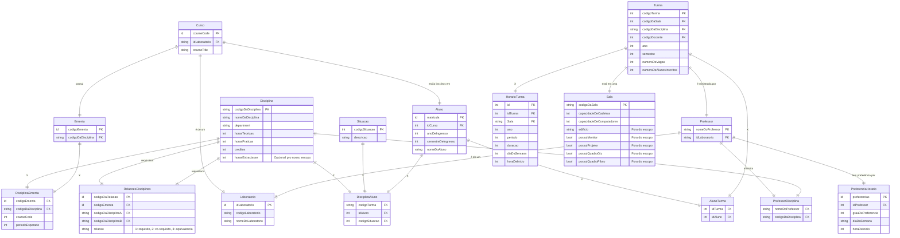

# Diagramas

```mermaid
erDiagram
  Curso ||--|| Aluno : "estão inscritos em"
  Curso ||--|| Ementa : "possui"
  Curso ||--|| Laboratorio : "é de um"
  Professor ||--|| Laboratorio : "é de um"
  Professor ||--|| PreferenciaHorario : "tem preferência por"
  Professor ||--|| ProfessorDisciplina : "ministra"
  Disciplina ||--|| ProfessorDisciplina : "ministra"
  Disciplina ||--|| DisciplinaAluno : "X"
  Disciplina ||--|| RelacoesDisciplinas : "requisitam"
  RelacoesDisciplinas ||--|| Disciplina : "requisitam"
  Disciplina ||--|| DisciplinaEmenta : "X"
  Ementa ||--|| DisciplinaEmenta : "X"
  Situacao ||--|| DisciplinaAluno : "X"
  Aluno ||--|| DisciplinaAluno : "X"
  Aluno ||--|| AlunoTurma : "X"
  Turma ||--|| AlunoTurma : "X"
  Turma ||--|| HorarioTurma : "X"
  Turma ||--|| Sala : "está em uma"
  Turma ||--|| Professor : "é ministrada por"

  Aluno {
    id matricula PK
    int idCurso FK
    int anoDeIngresso
    int semestreDeIngresso
    string nomeDoAluno
  }
  DisciplinaAluno {
    string codigoTurma FK
    int idAluno FK
    int codigoSituacao FK
    %% "string codigoDisciplina FK"
  }
  RelacoesDisciplinas {
    id codigoDaRelacao PK
    %% Não sei se isso tá sendo feito da forma correta
    id codigoEmenta FK
    string codigoDaDisciplinaA FK
    string codigoDaDisciplinaB FK
    string relacao "1: requisito, 2: co-requisito, 3: equivalencia"
  }
  DisciplinaEmenta {
    id codigoEmenta FK
    string codigoDaDisciplina FK
    int courseCode
    int periodoEsperado
  }
  AlunoTurma {
    int idTurma FK
    int idAluno FK
  }
  Turma {
    int codigoTurma PK
    int codigoDaSala FK
    string codigoDaDisciplina FK
    int codigoDocente FK
    int ano
    int semestre
    int numeroDeVagas
    int numeroDeAlunosInscritos
  }
  HorarioTurma {
    int id PK
    int idTurma FK
    string Sala FK
    int ano
    int periodo
    int duracao
    %% "% Separar horários numa classe separada?"
    int diaDaSemana
    int horaDeInicio
  }
  ProfessorDisciplina {
    string nomeDoProfessor FK
    string codigoDaDisciplina FK
  }
  PreferenciaHorario {
    id preferencias PK
    int idProfessor FK
    int grauDePreferencia
    %% "% Separar horários numa classe separada?"
    string diaDaSemana
    int horaDeInicio
  }
  %% Entidades estáticas Nível 2
  Disciplina {
    string codigoDaDisciplina PK
    string nomeDaDisciplina
    string department
    int horasTeoricas
    int horasPraticas
    int creditos
    int horasExtraclasse "Opcional pro nosso escopo"
  }
  Professor {
    string nomeDoProfessor PK
    string idLaboratorio FK
  }
  Sala {
    string codigoDaSala PK
    int capacidadeDeCadeiras
    int capacidadeDeComputadores
    string edificio "Fora do escopo"
    bool possuiMonitor "Fora do escopo"
    bool possuiProjetor "Fora do escopo"
    bool possuiQuadroGiz "Fora do escopo"
    bool possuiQuadroPiloto "Fora do escopo"
  }
  Ementa {
    id codigoEmenta PK
    string codigoDaDisciplina FK
  }
  %% Entidades estáticas Nível 1
  Situacao {
    int codigoSituacao PK
    string descricao
    %% "1: Aprovado, 2: Reprovado, 3: Cursando, 4: Não Cursado, 5: Outro"
  }
  Curso {
    id courseCode PK
    string idLaboratorio FK
    string courseTitle
  }
  Laboratorio {
    id idLaboratorio PK
    string codigoLaboratorio
    %% LAMET, LCFIS, LECIV, LCQUI, LAMAV, LCMAT, LEPROD, LENEP
    string nomeDoLaboratorio
  }
```
