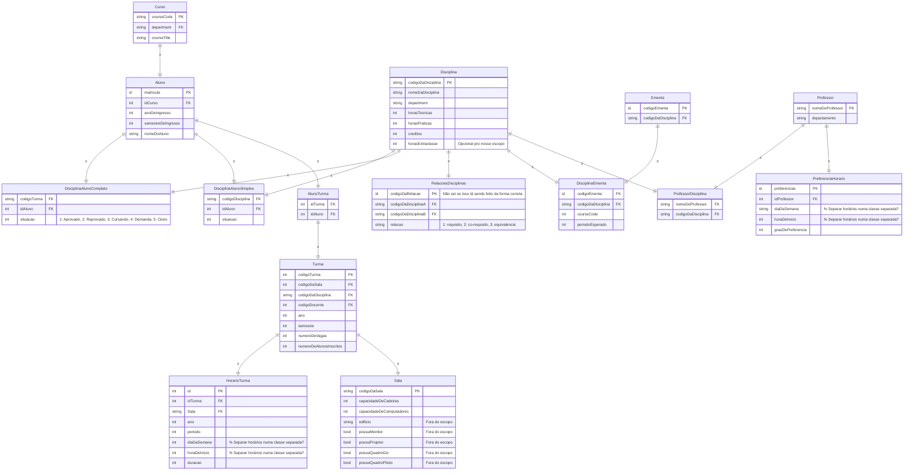

# Diagramas

```mermaid
erDiagram
  Curso ||--|| Aluno : "X"
  Aluno ||--|| DisciplinaAlunoCompleto : "X"
  Aluno ||--|| DisciplinaAlunoSimples : "X"
  Disciplina ||--|| DisciplinaAlunoSimples : "X"
  Disciplina ||--|| DisciplinaAlunoCompleto : "X"
  Disciplina ||--|| RelacoesDisciplinas : "X"
  Disciplina ||--|| DisciplinaEmenta : "X"
  Ementa ||--|| DisciplinaEmenta : "X"
  Aluno ||--|| AlunoTurma : "X"
  AlunoTurma ||--|| Turma : "X"
  Turma ||--|| HorarioTurma : "X"
  Turma ||--|| Sala : "X"
  Disciplina ||--|| ProfessorDisciplina : "X"
  Professor ||--|| ProfessorDisciplina : "X"
  Professor ||--|| PreferenciaHorario : "X"

  Curso {
    string courseCode PK
    string department FK
    string courseTitle
  }
  Aluno {
    id matricula PK
    int idCurso FK
    int anoDeIngresso
    int semestreDeIngresso
    string nomeDoAluno
  }
  DisciplinaAlunoCompleto {
    string codigoTurma FK
    int idAluno FK
    int situacao "1: Aprovado, 2: Reprovado, 3: Cursando, 4: Demanda, 5: Outro"
  }
  DisciplinaAlunoSimples {
    string codigoDisciplina FK
    int idAluno FK
    int situacao
  }
  Disciplina {
    string codigoDaDisciplina PK
    string nomeDaDisciplina
    string department
    int horasTeoricas
    int horasPraticas
    int creditos
    int horasExtraclasse "Opcional pro nosso escopo"
  }
  RelacoesDisciplinas {
    id codigoDaRelacao PK "Não sei se isso tá sendo feito da forma correta"
    string codigoDaDisciplinaA FK
    string codigoDaDisciplinaB FK
    string relacao "1: requisito, 2: co-requisito, 3: equivalencia"
  }
  DisciplinaEmenta {
    id codigoEmenta FK
    string codigoDaDisciplina FK
    int courseCode
    int periodoEsperado
  }
  Ementa {
    id codigoEmenta PK
    string codigoDaDisciplina FK
  }
  AlunoTurma {
    int idTurma FK
    int idAluno FK
  }
  Turma {
    int codigoTurma PK
    int codigoDaSala FK
    string codigoDaDisciplina FK
    int codigoDocente FK
    int ano
    int semestre
    int numeroDeVagas
    int numeroDeAlunosInscritos
  }
  HorarioTurma {
    int id PK
    int idTurma FK
    string Sala FK
    int ano
    int periodo
    int diaDaSemana "% Separar horários numa classe separada?"
    int horaDeInicio "% Separar horários numa classe separada?"
    int duracao
  }
  Sala {
    string codigoDaSala PK
    int capacidadeDeCadeiras
    int capacidadeDeComputadores
    string edificio "Fora do escopo"
    bool possuiMonitor "Fora do escopo"
    bool possuiProjetor "Fora do escopo"
    bool possuiQuadroGiz "Fora do escopo"
    bool possuiQuadroPiloto "Fora do escopo"
  }
  ProfessorDisciplina {
    string nomeDoProfessor FK
    string codigoDaDisciplina FK
  }
  Professor {
    string nomeDoProfessor PK
    string departamento
  }
  PreferenciaHorario {
    id preferencias PK
    int idProfessor FK
    string diaDaSemana "% Separar horários numa classe separada?"
    int horaDeInicio "% Separar horários numa classe separada?"
    int grauDePreferencia
  }
```
